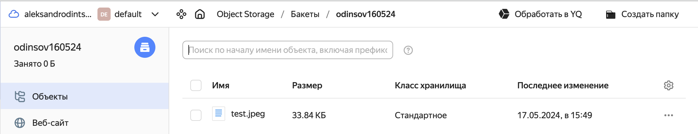
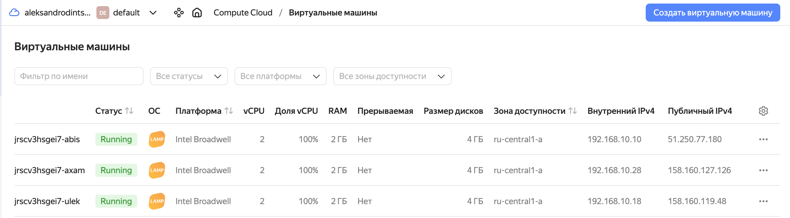
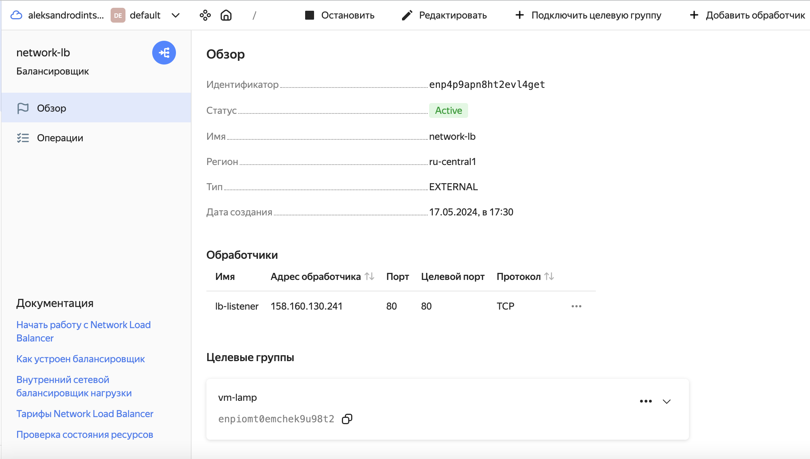
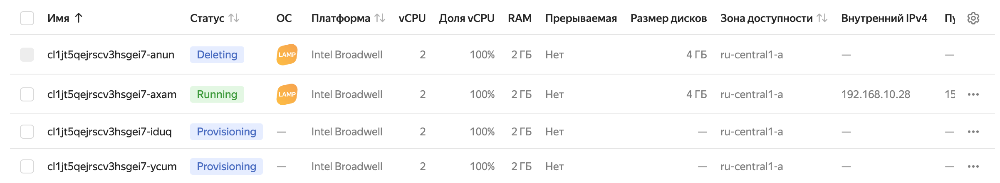

# [«Вычислительные мощности. Балансировщики нагрузки»  ](https://github.com/netology-code/clopro-homeworks/blob/main/15.2.md)
---
## Задание 1. Yandex Cloud 

**Что нужно сделать**

1. Создать бакет Object Storage и разместить в нём файл с картинкой:

 - Создать бакет в Object Storage с произвольным именем (например, _имя_студента_дата_).

Создаем сервисный аккаунт для  Object Storage

```
resource "yandex_iam_service_account" "srvac" {
  name = "srvac"
}
```

Назначаем роли сервисному аккаунту для работы с Object Storage

```
resource "yandex_resourcemanager_folder_iam_member" "srvac-editor" {
  folder_id = var.folder_id
  role      = "storage.editor"
  member    = "serviceAccount:${yandex_iam_service_account.srvac.id}"
}
```

Создаем статический ключ доступа

```
resource "yandex_iam_service_account_static_access_key" "srvac-static-key" {
  service_account_id = yandex_iam_service_account.srvac.id
  description        = "static access key for object storage"
}
```

Создаем корзину 

```
resource "yandex_storage_bucket" "odinsov160524" {
  access_key    = yandex_iam_service_account_static_access_key.srvac-static-key.access_key
  secret_key    = yandex_iam_service_account_static_access_key.srvac-static-key.secret_key
  bucket        = "odinsov160524"
  acl           = "public-read"
  force_destroy = "true"
}
```
 - Положить в бакет файл с картинкой.
 - Сделать файл доступным из интернета.
```
 resource "yandex_storage_object" "image-object" {
  access_key    = yandex_iam_service_account_static_access_key.srvac-static-key.access_key
  secret_key    = yandex_iam_service_account_static_access_key.srvac-static-key.secret_key
  bucket        = "odinsov160524"
  acl           = "public-read"
  key           = "test.jpeg"
  source        = "~/devops-netology/Cloud/15.2/scr/test.jpeg"
  depends_on    = [yandex_storage_bucket.odinsov160524]
}
 ```
<p align="center">
  
</p>
2. Создать группу ВМ в public подсети фиксированного размера с шаблоном LAMP и веб-страницей, содержащей ссылку на картинку из бакета:

 - Создать Instance Group с тремя ВМ и шаблоном LAMP. Для LAMP рекомендуется использовать `image_id = fd827b91d99psvq5fjit`.
для начало создадим сервисный аккаунт для работы Instance Group 

```
resource "yandex_iam_service_account" "srvac-ig" {
  name = "srvac-ig"
}

```
Назначаем роли сервисному аккаунту для работы с Instance Group 

```
resource "yandex_resourcemanager_folder_iam_member" "srvac-ig-editor" {
  folder_id = var.folder_id
  role      = "editor"
  member    = "serviceAccount:${yandex_iam_service_account.srvac-ig.id}"
}
```
Создаем Instance Group
```
resource "yandex_compute_instance_group" "lamp" {
  name                = "vm-lamp"
  folder_id           = var.folder_id
  service_account_id  = "${yandex_iam_service_account.srvac-ig.id}"
  deletion_protection = false
  instance_template {
    platform_id = var.vm_yandex_compute_instance_standart
    resources {
      memory = 2
      cores  = 2
    }
    boot_disk {
      mode = "READ_WRITE"
      initialize_params {
        image_id = "fd827b91d99psvq5fjit"
        size     = 4
      }
          }
    network_interface {
      network_id = "${yandex_vpc_network.vps.id}"
      subnet_ids = ["${yandex_vpc_subnet.public.id}"]
      nat        = "true"
    }
    }
  }
```

<p align="center">
  
</p>
 - Для создания стартовой веб-страницы рекомендуется использовать раздел `user_data` в [meta_data](https://cloud.yandex.ru/docs/compute/concepts/vm-metadata).

```
    metadata = {
      user-data          = data.template_file.cloudinit.rendered
  }
```
 - Разместить в стартовой веб-странице шаблонной ВМ ссылку на картинку из бакета.

```
data "template_file" "cloudinit" {
 template = file("${path.module}/cloud-init.yml")
 vars = {
   ssh_public_key = local.ssh-keys
   ssh_private_key = local.ssh-private-keys
   image_id = var.image_id
 }
}
```

```
variable "image_id" {
  type        = string
  default     = "https://storage.yandexcloud.net/odinsov160524/test.jpeg"
}
```

 - Настроить проверку состояния ВМ.

```
  health_check {
    http_options {
      port = 80
      path = "/index.html"
    }
  }

```
 
<p align="center">
  
</p>
3. Подключить группу к сетевому балансировщику:

 - Создать сетевой балансировщик.

```
resource "yandex_lb_network_load_balancer" "lb" {
  name = "network-lb"

  listener {
    name = "lb-listener"
    port = 80
    external_address_spec {
      ip_version = "ipv4"
    }
  }

  attached_target_group {
    target_group_id = yandex_compute_instance_group.lamp.load_balancer.0.target_group_id

    healthcheck {
      name = "http"
      http_options {
        port = 80
        path = "/index.html"
      }
    }
  }
  depends_on = [
    yandex_compute_instance_group.lamp
]
}
```
<p align="center">
  
</p>


 - Проверить работоспособность, удалив одну или несколько ВМ.
<p align="center">
  
</p>

