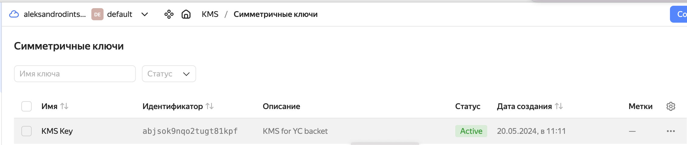
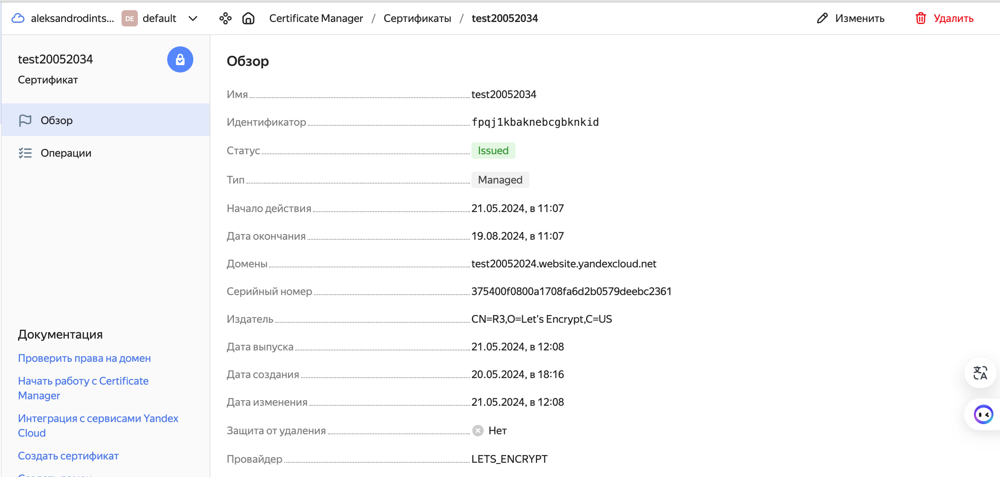

# [«Безопасность в облачных провайдерах»  ](https://github.com/netology-code/clopro-homeworks/blob/main/15.3.md)
---
## Задание 1. Yandex Cloud   

1. С помощью ключа в KMS необходимо зашифровать содержимое бакета:

 - создать ключ в KMS;

```
resource "yandex_kms_symmetric_key" "key-a" {
  name              = "KMS Key"
  description       = "KMS for YC backet"
  default_algorithm = "AES_128"
  rotation_period   = "8760h" // equal to 1 year
  lifecycle {
    prevent_destroy = false
  }
}
```

<p align="center">
  
</p>


 - с помощью ключа зашифровать содержимое бакета, созданного ранее.
```
server_side_encryption_configuration {
    rule {
      apply_server_side_encryption_by_default {
        kms_master_key_id = yandex_kms_symmetric_key.key-a.id
        sse_algorithm     = "aws:kms"
      }
    }
  }

```
2. (Выполняется не в Terraform)* Создать статический сайт в Object Storage c собственным публичным адресом и сделать доступным по HTTPS:

 - создать сертификат;
 <p align="center">
  
</p>
 - создать статическую страницу в Object Storage и применить сертификат HTTPS;
 - в качестве результата предоставить скриншот на страницу с сертификатом в заголовке (замочек).
 <p align="center">
  
</p>

Полезные документы:

- [Настройка HTTPS статичного сайта](https://cloud.yandex.ru/docs/storage/operations/hosting/certificate).
- [Object Storage bucket](https://registry.terraform.io/providers/yandex-cloud/yandex/latest/docs/resources/storage_bucket).
- [KMS key](https://registry.terraform.io/providers/yandex-cloud/yandex/latest/docs/resources/kms_symmetric_key).

--- 