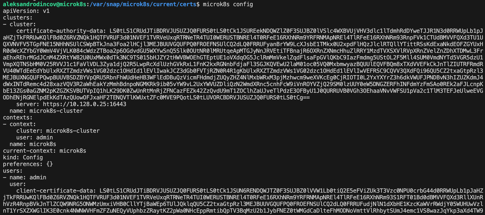

[Домашнее задание "Kubernetes. Причины появления. Команда kubectl"](https://github.com/netology-code/kuber-homeworks/blob/main/1.1/1.1.md?plain=1)

### Задание 1. Установка MicroK8S

1. Установить MicroK8S на локальную машину или на удалённую виртуальную машину.

  

2. Установить dashboard.

  

3. Сгенерировать сертификат для подключения к внешнему ip-адресу.
Добавлям внешний ip-адрес для подкючения 

  

перевыпускаем сертификаты

  

------

### Задание 2. Установка и настройка локального kubectl
1. Установить на локальную машину kubectl.

  

  

2. Настроить локально подключение к кластеру.

Берем  сертификаты из конфигурации microk8s

  

Упаковываем сетификаты в файлы

  

Создаем конфигурацию для kuberctl

  

Проверяем подключени к кластеру 

  

3. Подключиться к дашборду с помощью port-forward.

 Запускаем port-forward
 

  

Узнаем , где у нас лежит токен для подключения к дашборду

 

  

Забераем токен для входа в дашборд

 

  

Логинимся по токену в дашборд 

 

  

------

