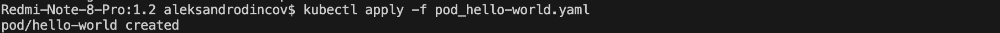
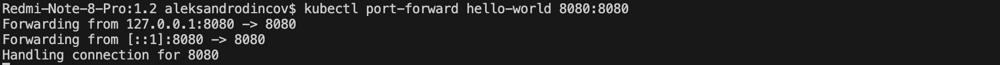
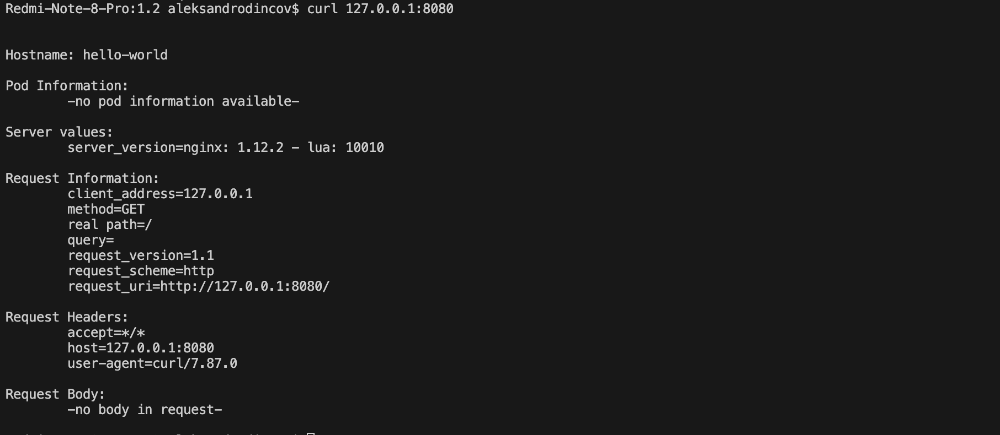
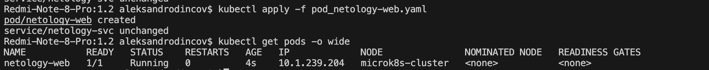
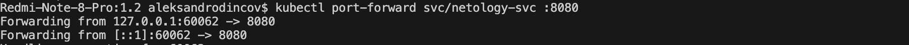
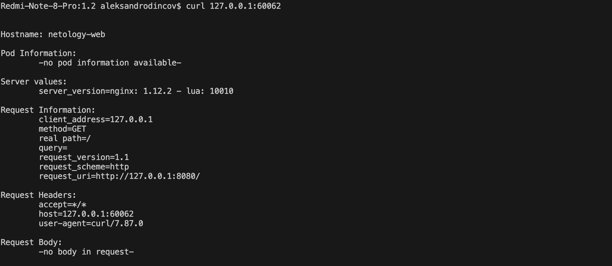

[Домашнее задание "Базовые объекты K8S""](https://github.com/netology-code/kuber-homeworks/blob/main/1.2/1.2.md)

### Задание 1. Создать Pod с именем hello-world

1. Создать манифест (yaml-конфигурацию) Pod.
```
apiVersion: v1
kind: Pod
metadata:
  name: hello-world
spec:
  containers:
    - name: echoserver
      image: gcr.io/kubernetes-e2e-test-images/echoserver:2.2
```
<p align="center">
  
</p>
2. Использовать image - gcr.io/kubernetes-e2e-test-images/echoserver:2.2.
3. Подключиться локально к Pod с помощью `kubectl port-forward` и вывести значение (curl или в браузере).
<p align="center">
  
</p>

<p align="center">
  
</p>


------

### Задание 2. Создать Service и подключить его к Pod

1. Создать Pod с именем netology-web.
2. Использовать image — gcr.io/kubernetes-e2e-test-images/echoserver:2.2.
```
apiVersion: v1
kind: Pod
metadata:
  labels:
    app: web
  name: netology-web
spec:
  containers:
    - name: echoserver
      image: gcr.io/kubernetes-e2e-test-images/echoserver:2.2
```

3. Создать Service с именем netology-svc и подключить к netology-web.
```
apiVersion: v1
kind: Service
metadata:
  name: netology-svc
spec:
  ports:
    - name: netology-web
      port: 8080
  selector:
    app: web
```
<p align="center">
  
</p>
4. Подключиться локально к Service с помощью `kubectl port-forward` и вывести значение (curl или в браузере).

<p align="center">
  
</p>
<p align="center">
  
</p>


------