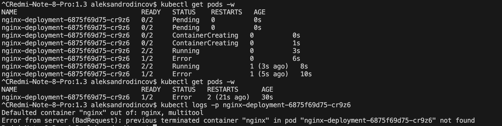

# [Домашнее задание к занятию «Запуск приложений в K8S»](https://github.com/netology-code/kuber-homeworks/blob/main/1.2/1.2.md)

### Задание 1. Создать Deployment и обеспечить доступ к репликам приложения из другого Pod

1. Создать Deployment приложения, состоящего из двух контейнеров — nginx и multitool. Решить возникшую ошибку.

```
apiVersion: apps/v1
kind: Deployment
metadata:
  name: nginx-deployment
  labels:
    app: nginx
spec:
  replicas: 1
  selector:
    matchLabels:
      app: nginx
  template:
    metadata:
      labels:
        app: nginx
    spec:
      containers:
        - name: nginx
          image: nginx:1.14.2
          ports:
            - containerPort: 80
        - name: multitool
          image: wbitt/network-multitool
```

<p align="center">
  
</p>

<p align="center">
  
</p>


```
    spec:
      containers:
        - name: nginx
          image: nginx:1.14.2
          ports:
            - containerPort: 80
        - name: multitool
          image: wbitt/network-multitool
          ports:
            - containerPort: 1180
          env:
            - name: HTTP_PORT
              value: "1180"
```

<p align="center">
  
</p>

2. После запуска увеличить количество реплик работающего приложения до 2.
3. Продемонстрировать количество подов до и после масштабирования.

<p align="center">
  
</p>
4. Создать Service, который обеспечит доступ до реплик приложений из п.1.

```
apiVersion: v1
kind: Service
metadata:
  name: nginx-svc
spec:
  selector:
    app: nginx
  ports:
    - name: nginx-svc
      protocol: TCP
      port: 80
      targetPort: 80
    - name: multitool-svc
      protocol: TCP
      port: 1180
      targetPort: 1180
```

5. Создать отдельный Pod с приложением multitool и убедиться с помощью `curl`, что из пода есть доступ до приложений из п.1.

```
apiVersion: v1
kind: Pod
metadata:
  name: multitool-pod
  labels:
    app: nginx
spec:
  containers:
    - name: multitool
      image: wbitt/network-multitool
```
<p align="center">
  
</p>

<p align="center">
  
</p>

<p align="center">
  
</p>
------

### Задание 2. Создать Deployment и обеспечить старт основного контейнера при выполнении условий

1. Создать Deployment приложения nginx и обеспечить старт контейнера только после того, как будет запущен сервис этого приложения.
```
apiVersion: apps/v1
kind: Deployment
metadata:
  name: nginx-deployment
spec:
  replicas: 1
  selector:
    matchLabels:
      app: nginx
  template:
    metadata:
      labels:
        app: nginx
    spec:
      initContainers:
        - name: init-busybox
          image: busybox
          command:
            [
              "sh",
              "-c",
              'until nslookup nginx-svc | grep "Name:"; do echo "Wait Service for get endpoint"; sleep 4; done',
            ]
      containers:
        - name: nginx
          image: nginx:1.14.2
          ports:
            - containerPort: 80
```
2. Убедиться, что nginx не стартует. В качестве Init-контейнера взять busybox.
<p align="center">
  
</p>

3. Создать и запустить Service. Убедиться, что Init запустился.
```
---
apiVersion: v1
kind: Service
metadata:
  name: nginx-svc
spec:
  selector:
    app: nginx
  ports:
    - name: nginx-svc
      protocol: TCP
      port: 80
      targetPort: 80
```
4. Продемонстрировать состояние пода до и после запуска сервиса.

<p align="center">
  
</p>

------