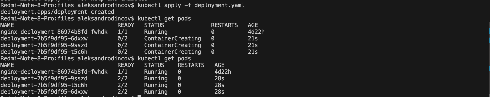
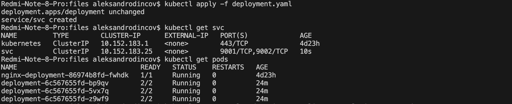
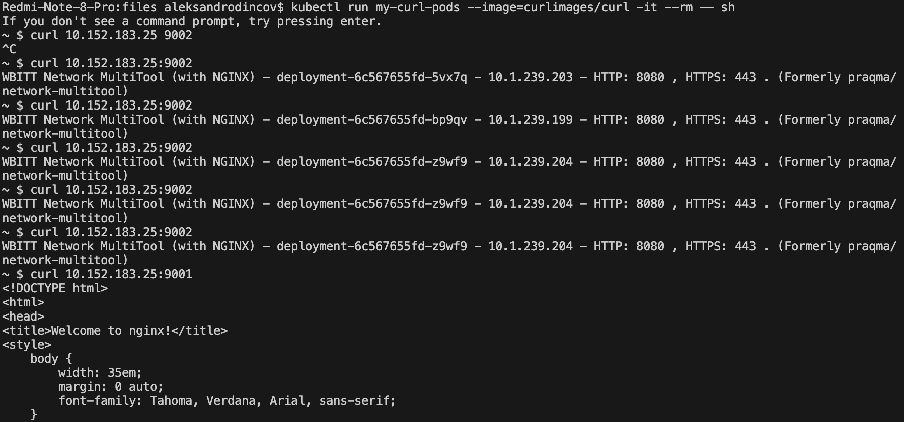
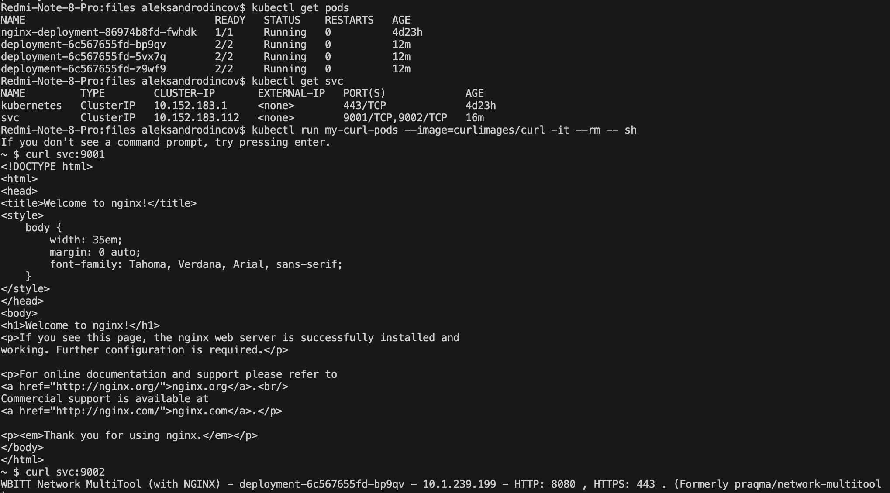
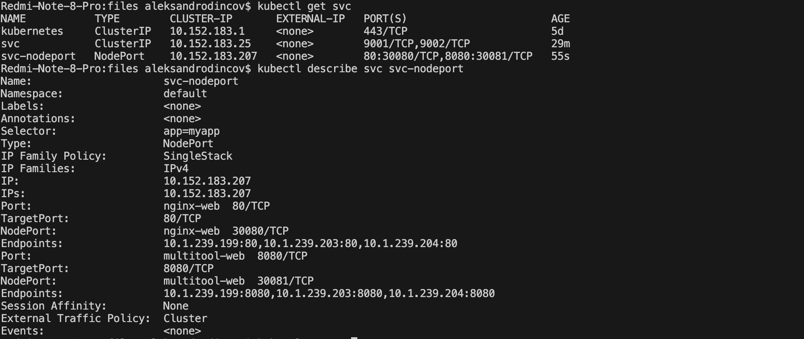
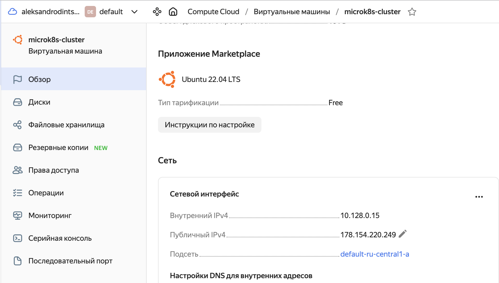
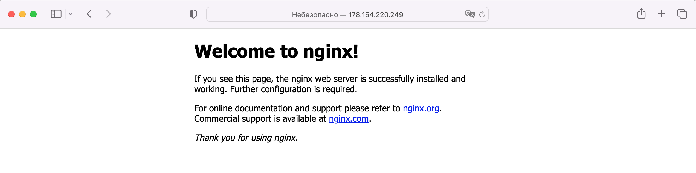

# [Домашнее задание к занятию «Сетевое взаимодействие в K8S. Часть 1»](https://github.com/netology-code/kuber-homeworks/blob/main/1.4/1.4.md)

### Задание 1. Создать Deployment и обеспечить доступ к контейнерам приложения по разным портам из другого Pod внутри кластера

1. Создать Deployment приложения, состоящего из двух контейнеров (nginx и multitool), с количеством реплик 3 шт.
```
apiVersion: apps/v1
kind: Deployment
metadata:
  name: deployment
  labels:
    app: myapp
spec:
  replicas: 3
  selector:
    matchLabels:
      app: myapp
  template:
    metadata:
      labels:
        app: myapp
    spec:
      containers:
        - name: nginx
          image: nginx:1.14.2
          ports:
            - containerPort: 80
        - name: multitool
          image: wbitt/network-multitool
          env:
            - name: HTTP_PORT
              value: "8080"
```
<p align="center">
  
</p>
2. Создать Service, который обеспечит доступ внутри кластера до контейнеров приложения из п.1 по порту 9001 — nginx 80, по 9002 — multitool 8080.
```
apiVersion: v1
kind: Service
metadata:
  name: svc
spec:
  selector:
    app: myapp
  ports:
    - name: nginx-svc
      protocol: TCP
      port: 9001
      targetPort: 80
    - name: multitool-svc
      protocol: TCP
      port: 9002
      targetPort: 8080
```
<p align="center">
  
</p>

3. Создать отдельный Pod с приложением multitool и убедиться с помощью `curl`, что из пода есть доступ до приложения из п.1 по разным портам в разные контейнеры.

<p align="center">
  
</p>

4. Продемонстрировать доступ с помощью `curl` по доменному имени сервиса.

<p align="center">
  
</p>

5. Предоставить манифесты [Deployment и Service](/files/deployment.yaml) в решении, а также скриншоты или вывод команды п.4.

------

### Задание 2. Создать Service и обеспечить доступ к приложениям снаружи кластера

1. Создать отдельный Service приложения из Задания 1 с возможностью доступа снаружи кластера к nginx, используя тип NodePort.
```
---
apiVersion: v1
kind: Service
metadata:
  name: svc-nodeport
spec:
  selector:
    app: myapp
  ports:
    - name: nginx-web
      protocol: TCP
      port: 80
      nodePort: 30080
    - name: multitool-web
      protocol: TCP
      port: 8080
      nodePort: 30081
  type: NodePort
```
<p align="center">
  
</p>
2. Продемонстрировать доступ с помощью браузера или `curl` с локального компьютера.
<p align="center">
  
</p>

<p align="center">
  
</p>

3. Предоставить манифест и [Service](/files/svc_nodeport.yaml) в решении, а также скриншоты или вывод команды п.2.

------