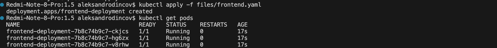
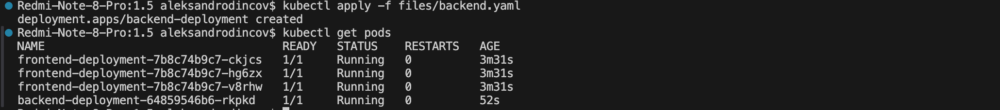
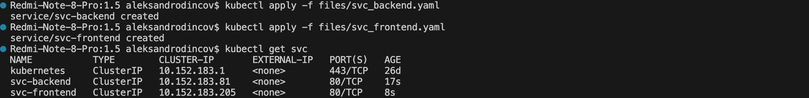
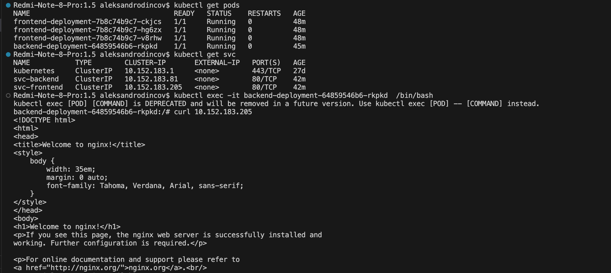
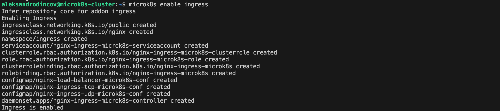
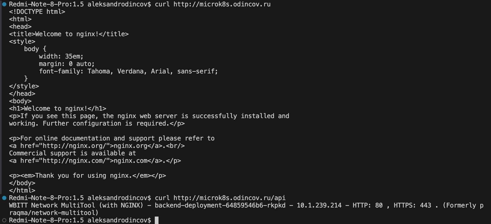

# [Домашнее задание к занятию «Сетевое взаимодействие в K8S. Часть 2»](https://github.com/netology-code/kuber-homeworks/blob/main/1.5/1.5.md)

### Задание 1. Создать Deployment приложений backend и frontend

1. Создать Deployment приложения _frontend_ из образа nginx с количеством реплик 3 шт.
```
apiVersion: apps/v1
kind: Deployment
metadata:
  name: frontend-deployment
  labels:
    app: frontend
spec:
  replicas: 3
  selector:
    matchLabels:
      app: frontend
  template:
    metadata:
      labels:
        app: frontend
    spec:
      containers:
        - name: nginx-frontend
          image: nginx:1.14.2
          ports:
            - containerPort: 80
              name: frontend-port
```
<p align="center">
  
</p>
2. Создать Deployment приложения _backend_ из образа multitool. 
```
apiVersion: apps/v1
kind: Deployment
metadata:
  name: backend-deployment
  labels:
    app: backend
spec:
  replicas: 1
  selector:
    matchLabels:
      app: backend
  template:
    metadata:
      labels:
        app: backend
    spec:
      containers:
        - name: multitool
          image: wbitt/network-multitool
          ports:
            - containerPort: 80
              name: backend-port
```
<p align="center">
  
</p>
3. Добавить Service, которые обеспечат доступ к обоим приложениям внутри кластера. 
```
apiVersion: v1
kind: Service
metadata:
  name: svc-frontend
spec:
  selector:
    app: frontend
  ports:
    - name: frontend-svc
      protocol: TCP
      port: 80
      targetPort: 80
```


```
apiVersion: v1
kind: Service
metadata:
  name: svc-backend
spec:
  selector:
    app: backend
  ports:
    - name: backend-svc
      protocol: TCP
      port: 80
      targetPort: 80
```
<p align="center">
  
</p>
4. Продемонстрировать, что приложения видят друг друга с помощью Service.
<p align="center">
  
</p>
5. Предоставить манифесты Deployment и Service в решении, а также скриншоты или вывод команды п.4.

------

### Задание 2. Создать Ingress и обеспечить доступ к приложениям снаружи кластера

1. Включить Ingress-controller в MicroK8S.
<p align="center">
  
</p>
2. Создать Ingress, обеспечивающий доступ снаружи по IP-адресу кластера MicroK8S так, чтобы при запросе только по адресу открывался _frontend_ а при добавлении /api - _backend_.
```
apiVersion: networking.k8s.io/v1
kind: Ingress
metadata:
  name: ingress-apps
  annotations:
    nginx.ingress.kubernetes.io/rewrite-target: /
spec:
  ingressClassName: nginx
  rules:
    - host: microk8s.odincov.ru
      http:
        paths:
          - path: /
            pathType: Prefix
            backend:
              service:
                name: svc-frontend
                port:
                  number: 80
          - path: /api
            pathType: Prefix
            backend:
              service:
                name: svc-backend
                port:
                  number: 80
---
apiVersion: v1
kind: Service
metadata:
  name: ingress
spec:
  selector:
    name: nginx-ingress-microk8s
  type: LoadBalancer
  loadBalancerIP: 192.168.0.216
  ports:
    - name: http
      protocol: TCP
      port: 80
      targetPort: 80
    - name: https
      protocol: TCP
      port: 443
      targetPort: 443

```

3. Продемонстрировать доступ с помощью браузера или `curl` с локального компьютера.
<p align="center">
  
</p>
4. Предоставить манифесты и скриншоты или вывод команды п.2.