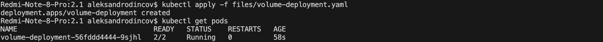
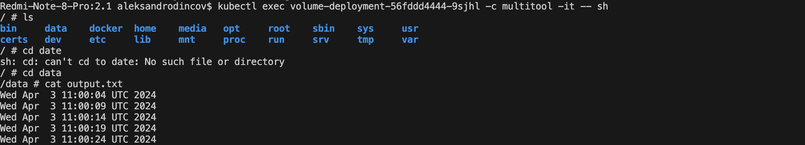
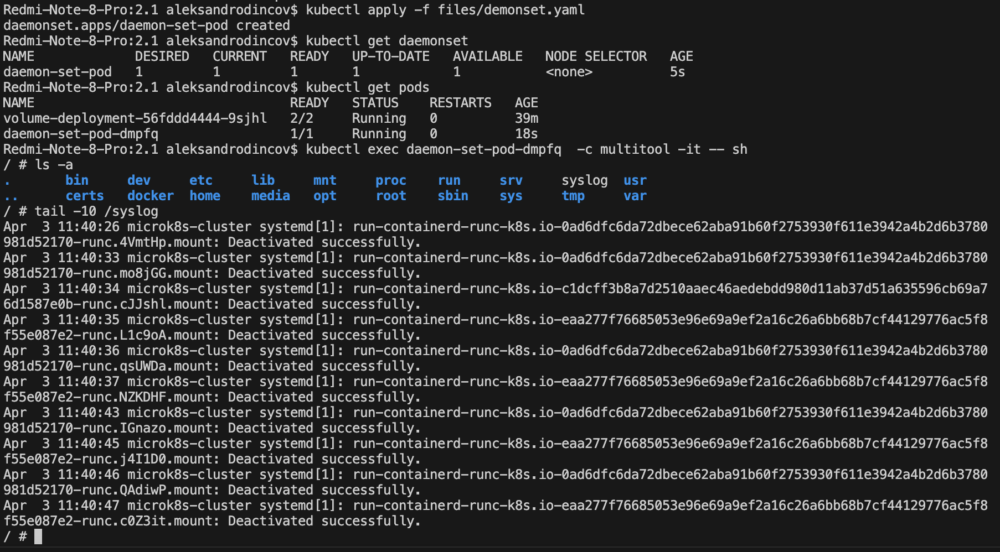

# [Домашнее задание к занятию «Хранение в K8s. Часть 1»](https://github.com/netology-code/kuber-homeworks/blob/main/2.1/2.1.md)


### Задание 1 

**Что нужно сделать**

Создать Deployment приложения, состоящего из двух контейнеров и обменивающихся данными.

1. Создать Deployment приложения, состоящего из контейнеров busybox и multitool.
2. Сделать так, чтобы busybox писал каждые пять секунд в некий файл в общей директории.
3. Обеспечить возможность чтения файла контейнером multitool.

```
apiVersion: apps/v1
kind: Deployment
metadata:
  name: volume-deployment
  labels:
    app: volume
spec:
  selector:
    matchLabels:
      app: volume
  template:
    metadata:
      labels:
        app: volume
    spec:
      containers:
        - name: busybox
          image: busybox
          command:
            [
              "/bin/sh",
              "-c",
              "while true; do date >> /data/output.txt; sleep 5; done",
            ]
          volumeMounts:
            - name: my-volume
              mountPath: /data
        - name: multitool
          image: wbitt/network-multitool
          command: ["/bin/sh", "-c", "tail -f /data/output.txt"]
          volumeMounts:
            - name: my-volume
              mountPath: /data
      volumes:
        - name: my-volume
          emptyDir: {}

```
<p align="center">
  
</p>

4. Продемонстрировать, что multitool может читать файл, который периодоически обновляется.

<p align="center">
  
</p>

5. Предоставить манифесты Deployment в решении, а также скриншоты или вывод команды из п. 4.

------

### Задание 2

**Что нужно сделать**

Создать DaemonSet приложения, которое может прочитать логи ноды.

1. Создать DaemonSet приложения, состоящего из multitool.
2. Обеспечить возможность чтения файла `/var/log/syslog` кластера MicroK8S.

```
apiVersion: apps/v1
kind: DaemonSet
metadata:
  name: daemon-set-pod
  labels:
    app: volume
spec:
  selector:
    matchLabels:
      app: volume
  template:
    metadata:
      labels:
        app: volume
    spec:
      containers:
        - name: multitool
          image: wbitt/network-multitool
          volumeMounts:
            - name: syslog
              mountPath: /syslog
      volumes:
        - name: syslog
          hostPath:
            path: /var/log/syslog

```

3. Продемонстрировать возможность чтения файла изнутри пода.

<p align="center">
  
</p>
4. Предоставить манифесты Deployment, а также скриншоты или вывод команды из п. 2.

------