# [Домашнее задание к занятию «Хранение в K8s. Часть 2»](https://github.com/netology-code/kuber-homeworks/tree/main/2.2)

### Задание 1

**Что нужно сделать**

Создать Deployment приложения, использующего локальный PV, созданный вручную.

1. Создать Deployment приложения, состоящего из контейнеров busybox и multitool.
```
apiVersion: apps/v1
kind: Deployment
metadata:
  name: storage-deployment
  namespace: lesson6
  labels:
    app: storage
spec:
  selector:
    matchLabels:
      app: storage
  template:
    metadata:
      labels:
        app: storage
    spec:
      containers:
        - name: busybox
          image: busybox
          command:
            [
              "/bin/sh",
              "-c",
              "while true; do date >> /data/output.txt; sleep 5; done",
            ]
          volumeMounts:
            - name: storage
              mountPath: /data
        - name: multitool
          image: wbitt/network-multitool
          command: ["/bin/sh", "-c", "tail -f /data/output.txt"]
          volumeMounts:
            - name: storage
              mountPath: /data
      volumes:
        - name: storage
          persistentVolumeClaim:
            claimName: pvc-manual

```
<p align="center">
  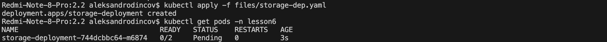
</p>
 
 Поды находяться в стостоянии Pending т.к. в монифесте указан PVC , но он еще не создан 

2. Создать PV и PVC для подключения папки на локальной ноде, которая будет использована в поде.
```
apiVersion: v1
kind: PersistentVolumeClaim
metadata:
  name: pvc-manual
  namespace: lesson6
spec:
  storageClassName: ""
  accessModes:
    - ReadWriteOnce
  resources:
    requests:
      storage: 1Mi
---
apiVersion: v1
kind: PersistentVolume
metadata:
  name: pv-manual
spec:
  storageClassName: ""
  accessModes:
    - ReadWriteOnce
  capacity:
    storage: 1Mi
  hostPath:
    path: /data/pv
  persistentVolumeReclaimPolicy: Delete

```
<p align="center">
  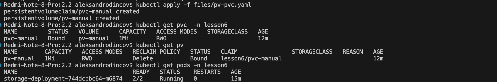
</p>

После создания PVC и PV , Voleume прилинковался к подам и они перешли в стостояниее Running 

3. Продемонстрировать, что multitool может читать файл, в который busybox пишет каждые пять секунд в общей директории. 
<p align="center">
  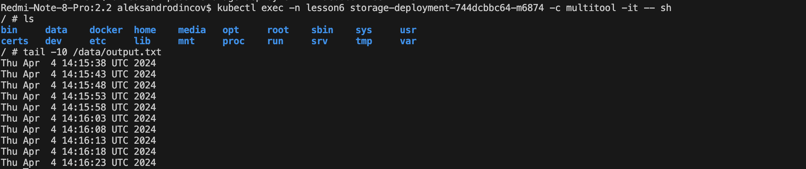
</p>

4. Удалить Deployment и PVC. Продемонстрировать, что после этого произошло с PV. Пояснить, почему.
<p align="center">
  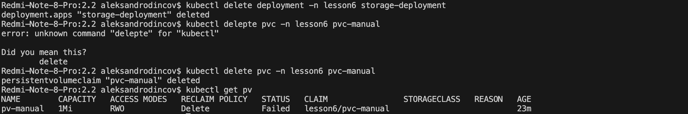
</p>
PV перешел в статус Failed потому что отсутсвтует PVC 
5. Продемонстрировать, что файл сохранился на локальном диске ноды. 
<p align="center">
  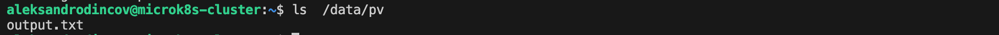
</p>
Удалить PV. 
<p align="center">
  
</p>
 Продемонстрировать что произошло с файлом после удаления PV. Пояснить, почему.
 <p align="center">
  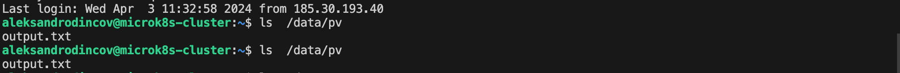
</p>

Файл не удалился т.к. не была установлена политка Retain
5. Предоставить манифесты, а также скриншоты или вывод необходимых команд.

------

### Задание 2

**Что нужно сделать**

Создать Deployment приложения, которое может хранить файлы на NFS с динамическим созданием PV.

1. Включить и настроить NFS-сервер на MicroK8S.

 <p align="center">
  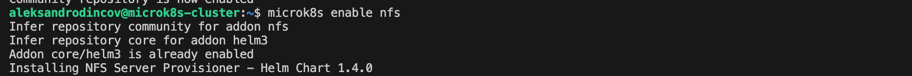
</p>

 <p align="center">
  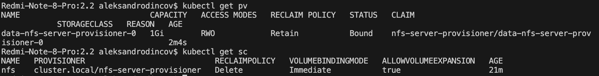
</p>

2. Создать Deployment приложения состоящего из multitool, и подключить к нему PV, созданный автоматически на сервере NFS.

```
apiVersion: apps/v1
kind: Deployment
metadata:
  name: nfs-deployment
  namespace: lesson6
  labels:
    app: storage
spec:
  selector:
    matchLabels:
      app: storage
  template:
    metadata:
      labels:
        app: storage
    spec:
      containers:
        - name: multitool
          image: wbitt/network-multitool
          volumeMounts:
            - name: pvc
              mountPath: /nfs
      volumes:
        - name: pvc
          persistentVolumeClaim:
            claimName: nfs-pvc
---
apiVersion: v1
kind: PersistentVolumeClaim
metadata:
  name: nfs-pvc
  namespace: lesson6
spec:
  storageClassName: nfs
  accessModes:
    - ReadWriteOnce
  resources:
    requests:
      storage: 200Mi
```

 <p align="center">
  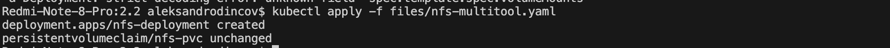
</p>

 <p align="center">
  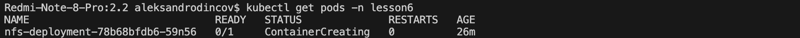
</p>

После создания пода , контейнер с multitool так и не поднялся , команда  ``` Kubectl describe pod -n lesson6 nfs-deployment-78b68bfdb6-59n56 ``` показала нам что ошибка при монтировании тома ```Warning  FailedMount  14s (x21 over 26m)  kubelet  MountVolume.SetUp failed for volume "pvc-410dd2e5-ce1d-43b2-94a7-48b57b38cbe3" : mount failed: exit status 32 ``` , изучив данную ошибку , нашел решение - необходимо установить nfs-common на все узлы microk8s.

Устанавлвиваем nfs-common 
 <p align="center">
  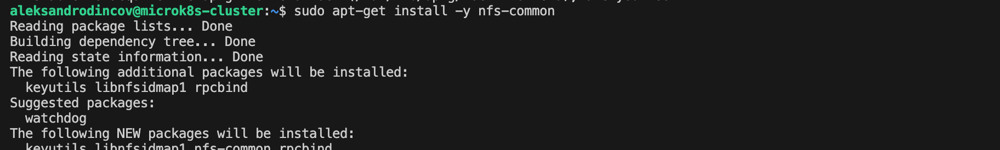
</p>

после чего контейнер в поде поднялся 
 <p align="center">
  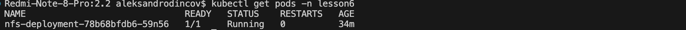
</p>

3. Продемонстрировать возможность чтения и записи файла изнутри пода. 
 <p align="center">
  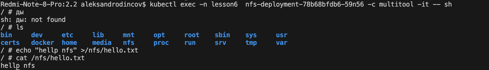
</p>
4. Предоставить манифесты, а также скриншоты или вывод необходимых команд.

------