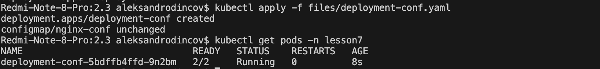
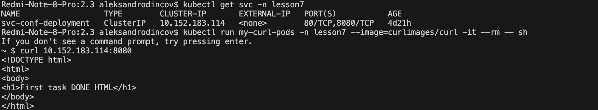
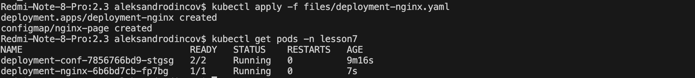
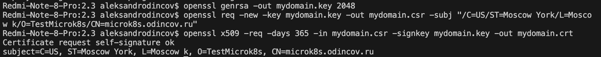
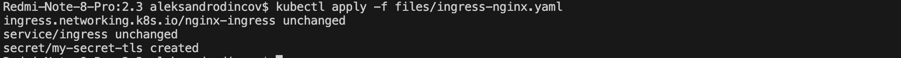
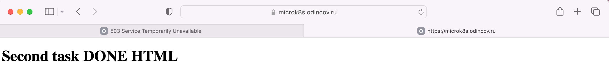

# [Домашнее задание к занятию «Конфигурация приложений»](https://github.com/netology-code/kuber-homeworks/blob/main/2.3/2.3.md)

### Задание 1. Создать Deployment приложения и решить возникшую проблему с помощью ConfigMap. Добавить веб-страницу

1. Создать Deployment приложения, состоящего из контейнеров nginx и multitool.
```
apiVersion: apps/v1
kind: Deployment
metadata:
  name: deployment-conf
  namespace: lesson7
  labels:
    app: configuration
spec:
  replicas: 1
  selector:
    matchLabels:
      app: configuration
  template:
    metadata:
      labels:
        app: configuration
    spec:
      containers:
        - name: multitool
          image: wbitt/network-multitool
        - name: nginx
          image: nginx
          ports:
            - containerPort: 8080
          volumeMounts:
            - name: nginx-conf
              mountPath: /etc/nginx/nginx.conf
              subPath: nginx.conf
              readOnly: true
      volumes:
        - name: nginx-conf
          configMap:
            name: nginx-conf
            items:
              - key: nginx.conf
                path: nginx.conf
```


2. Решить возникшую проблему с помощью ConfigMap.
```
apiVersion: v1
kind: ConfigMap
metadata:
  name: nginx-conf
  namespace: lesson7
data:
  nginx.conf: |
    user nginx;
    worker_processes  1;
    events {
      worker_connections  10240;
    }
    http {
      server {
          listen       8080;
          server_name  localhost;
          location / {
            root   html;
            index  index.html index.htm;
        }
      }
    }

```
3. Продемонстрировать, что pod стартовал и оба конейнера работают.
<p align="center">
  
</p>
4. Сделать простую веб-страницу и подключить её к Nginx с помощью ConfigMap. 

```
apiVersion: apps/v1
kind: Deployment
metadata:
  name: deployment-conf
  namespace: lesson7
  labels:
    app: configuration
spec:
  replicas: 1
  selector:
    matchLabels:
      app: configuration
  template:
    metadata:
      labels:
        app: configuration
    spec:
      containers:
        - name: multitool
          image: wbitt/network-multitool
          ports:
            - containerPort: 80
        - name: nginx
          image: nginx
          ports:
            - containerPort: 8080
          volumeMounts:
            - name: nginx-conf
              mountPath: /etc/nginx/conf.d
            - name: nginx-conf
              mountPath: /usr/share/nginx/html
          env:
            - name: HTTP_PORT
              value: "8080"
      volumes:
        - name: nginx-conf
          configMap:
            name: nginx-conf
---
apiVersion: v1
kind: ConfigMap
metadata:
  name: nginx-conf
  namespace: lesson7
data:
  nginx.conf: |
    server {
      listen 8080;
      server_name localhost;

      location / {
        root /usr/share/nginx/html;
        index index.html;
      }
    }
  index.html: |
    <!DOCTYPE html>
    <html>
    <body>
    <h1>First task DONE HTML</h1>
    </body>
    </html>


```

Подключить Service и показать вывод curl или в браузере.
```

apiVersion: v1
kind: Service
metadata:
  name: svc-backend
spec:
  selector:
    app: configuration
  ports:
    - name: multitool-port
      protocol: TCP
      port: 80
      targetPort: 80
    - name: nginx-port
      protocol: TCP
      port: 8080
      targetPort: 8080
  type: ClusterIP
```

<p align="center">
  
</p>

5. Предоставить манифесты, а также скриншоты или вывод необходимых команд.

------

### Задание 2. Создать приложение с вашей веб-страницей, доступной по HTTPS 

1. Создать Deployment приложения, состоящего из Nginx.
2. Создать собственную веб-страницу и подключить её как ConfigMap к приложению.
```
apiVersion: apps/v1
kind: Deployment
metadata:
  name: deployment-nginx
  namespace: lesson7
  labels:
    app: configuration
spec:
  replicas: 1
  selector:
    matchLabels:
      app: configuration
  template:
    metadata:
      labels:
        app: configuration
    spec:
      containers:
        - name: nginx
          image: nginx
          ports:
            - containerPort: 80
          volumeMounts:
            - name: nginx-page
              mountPath: /usr/share/nginx/html
      volumes:
        - name: nginx-page
          configMap:
            name: nginx-page

---
apiVersion: v1
kind: ConfigMap
metadata:
  name: nginx-page
  namespace: lesson7
data:
  index.html: |
    <!DOCTYPE html>
    <html>
    <body>
    <h1>Second task DONE HTML</h1>
    </body>
    </html>
---


```
<p align="center">
  
</p>

3. Выпустить самоподписной сертификат SSL. Создать Secret для использования сертификата.

Выпускаем самоподписный сертификат 

<p align="center">
  
</p>

После чего все конвертируем в base64 

```
apiVersion: v1
kind: Secret
metadata:
  name: my-secret-tls
data:
  tls.crt: base64 
  tls.key: base64 
type: kubernetes.io/tls

```

4. Создать Ingress и необходимый Service, подключить к нему SSL в вид.
```
apiVersion: networking.k8s.io/v1
kind: Ingress
metadata:
  name: nginx-ingress
  namespace: lesson7
  annotations:
    nginx.ingress.kubernetes.io/rewrite-target: /
spec:
  ingressClassName: nginx
  rules:
    - host: microk8s.odincov.ru
      http:
        paths:
          - path: /
            pathType: Prefix
            backend:
              service:
                name: svc-nginx
                port:
                  number: 80
  tls:
    - hosts:
        - microk8s.odincov.ru
      secretName: my-secret-tls
---
apiVersion: v1
kind: Service
metadata:
  name: ingress
  namespace: lesson7
spec:
  selector:
    name: nginx-ingress-microk8s
  type: LoadBalancer
  loadBalancerIP: 192.168.0.215
  ports:
    - name: http
      protocol: TCP
      port: 80
      targetPort: 80
    - name: https
      protocol: TCP
      port: 443
      targetPort: 443
```
<p align="center">
  
</p>

 Продемонстировать доступ к приложению по HTTPS. 
 <p align="center">
  
</p>

4. Предоставить манифесты, а также скриншоты или вывод необходимых команд.