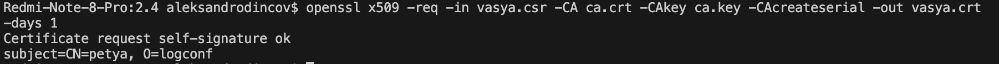
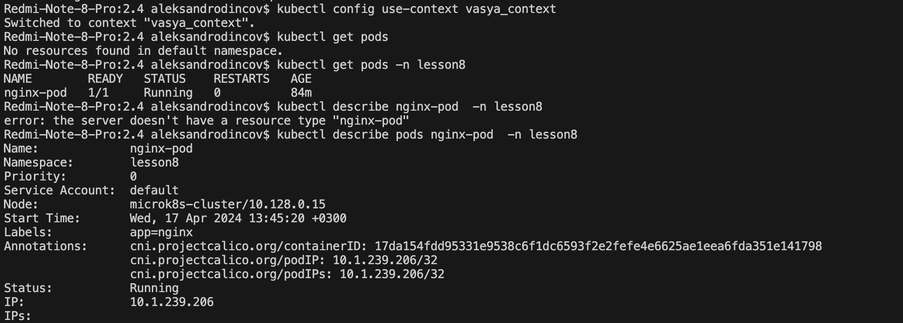
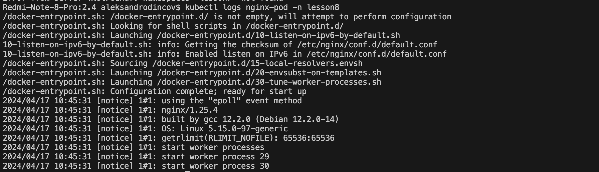

# [Домашнее задание к занятию «Управление доступом»](https://github.com/netology-code/kuber-homeworks/blob/main/2.4/2.4.md)

### Задание 1. Создайте конфигурацию для подключения пользователя
1. Создайте и подпишите SSL-сертификат для подключения к кластеру.
Создаем сертификат для пользователя 
генерируем ключ

```
openssl genrsa -out vasya.key 2048
```

создаем csr запрос для пользователя 

```
openssl req -new -key vasya.key -out  vasya.csr -subj "/CN=petya/O=logconf"

```
Забираем с ноды /var/snap/microk8s/current/certs/ca.crt   и /var/snap/microk8s/current/certs/ca.key
создаем сертификат

```
openssl x509 -req -in vasya.csr -CA ca.crt -CAkey ca.key -CAcreateserial -out vasya.crt -days 1
```

<p align="center">
  
</p>

2. Настройте конфигурационный файл kubectl для подключения.
Создаем пользователя и добоавляем его в конфигурацю 
````
kubectl config set-credentials vasya --client-certificate vasya.crt --client-key vasya.key --embed-certs=true

```

<p align="center">
  
</p>

```
kubectl config set-context vasya_context --cluster=microk8s-cluster --user=vasya

```
<p align="center">
  
</p>

3. Создайте роли и все необходимые настройки для пользователя.
4. Предусмотрите права пользователя. Пользователь может просматривать логи подов и их конфигурацию 
(`kubectl logs pod <pod_id>`, `kubectl describe pod <pod_id>`).

```
apiVersion: rbac.authorization.k8s.io/v1
kind: Role
metadata:
  namespace: lesson8
  name: pod-reader
rules:
  - apiGroups: [""]
    resources: ["pods", "pods/log"]
    verbs: ["get", "list", "watch", "describe"]
---
apiVersion: rbac.authorization.k8s.io/v1
kind: RoleBinding
metadata:
  name: pod-reader-rb
  namespace: lesson8
subjects:
  - kind: User
    name: vasya
    apiGroup: rbac.authorization.k8s.io
roleRef:
  kind: Role
  name: pod-reader
  apiGroup: rbac.authorization.k8s.io
```
<p align="center">
  
</p>
<p align="center">
  
</p>
5. Предоставьте манифесты и скриншоты и/или вывод необходимых команд.