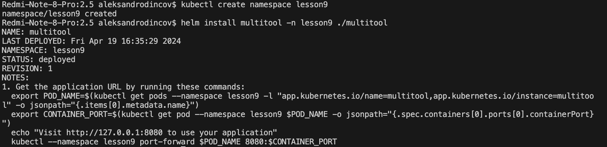

# [Домашнее задание к занятию «Helm»](https://github.com/netology-code/kuber-homeworks/blob/main/2.5/2.5.md)

### Задание 1. Подготовить Helm-чарт для приложения

1. Необходимо упаковать приложение в чарт для деплоя в разные окружения. 
Создаем helm chart 

```
helm create multitool
```
редактируем образ , теги чарта , добавляем описание версий 

```
image:
  repository: docker.io/wbitt/network-multitool
  pullPolicy: IfNotPresent
  # Overrides the image tag whose default is the chart appVersion.
  tag: ""
```

```
appVersion:
  "latest" # latest / extra / openshift / openshift-extra / fedora


  # Variants / image tags:
  # latest, minimal, alpine-minimal ( The main/default 'minimal' image - Alpine based )
  # extra, alpine-extra (Alpine based image - with extra tools )
  # openshift , openshift-minimal (openshift compatible - minimal) - Ports: 1180, 11443
  # openshift-extra (openshift compatible with extra tools) - Ports: 1180, 11443
  # fedora, fedora-minimal ( 'Minimal' Fedora based image )
```
пробуем развернуть 

<p align="center">
  
</p>

2. Каждый компонент приложения деплоится отдельным deployment’ом или statefulset’ом.
3. В переменных чарта измените образ приложения для изменения версии.

<p align="center">
  
</p>

меняем appVersion чарта и обновляемся 

<p align="center">
  
</p>

------
### Задание 2. Запустить две версии в разных неймспейсах

1. Подготовив чарт, необходимо его проверить. Запуститe несколько копий приложения.
2. Одну версию в namespace=app1, вторую версию в том же неймспейсе, третью версию в namespace=app2.

```
helm install multitool -n app2 ./multitool --create-namespace 
```

<p align="center">
  
</p>

3. Продемонстрируйте результат.

<p align="center">
  
</p>