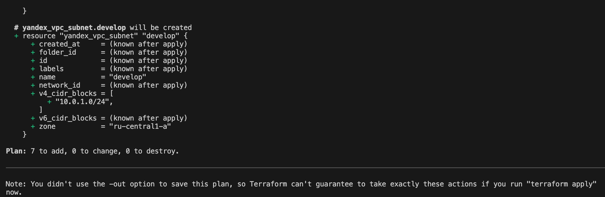
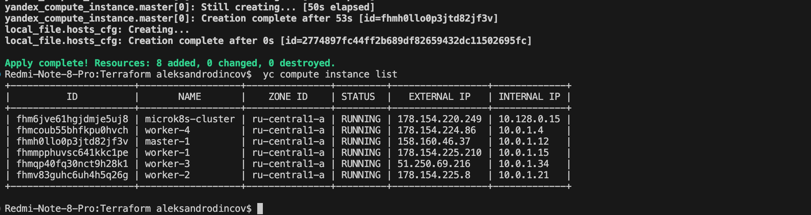
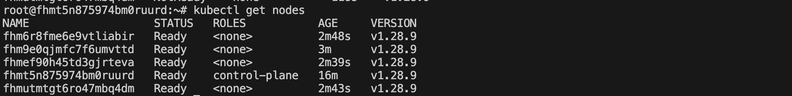

# [Домашнее задание к занятию «Установка Kubernetes»](https://github.com/netology-code/kuber-homeworks/blob/main/3.2/3.2.md)

### Задание 1. Установить кластер k8s с 1 master node

1. Подготовка работы кластера из 5 нод: 1 мастер и 4 рабочие ноды.
2. В качестве CRI — containerd.
3. Запуск etcd производить на мастере.
4. Способ установки выбрать самостоятельно.

## Дополнительные задания (со звёздочкой)

**Настоятельно рекомендуем выполнять все задания под звёздочкой.** Их выполнение поможет глубже разобраться в материале.   
Задания под звёздочкой необязательные к выполнению и не повлияют на получение зачёта по этому домашнему заданию. 

------
### Задание 2*. Установить HA кластер

1. Установить кластер в режиме HA.
2. Использовать нечётное количество Master-node.
3. Для cluster ip использовать keepalived или другой способ.

### Задание 1. Установить кластер k8s с 1 master node

Развертывать кластер мы будем через terraform 
для использования конфигурации необходимо создать файл personal.auto.tfvars и добавить его в [.gitignore](files/Terraform/.gitignore) 
в файле personal.auto.tfvars нужно указать token , [cloud_id](https://yandex.cloud/ru/docs/resource-manager/operations/cloud/get-id) , [folder_id](https://yandex.cloud/en/docs/resource-manager/operations/folder/get-id)
```
token  =  <token_yc>
cloud_id  = <my_cloud_id>
folder_id = <my_folder_id>
```

нам так же понадобиться установить себе  [Terraform версии =1.5.Х ](https://yandex.cloud/ru/docs/ydb/terraform/install)(версия 1.6 может вызывать проблемы с Яндекс провайдером)

В манифесте [main.tf](files/Terraform/main.tf) указываем пусть для SSH ключ 

Шаблон [hosts.tftpl ](files/Terraform/hosts.tftpl)сконфигурирует файл для дальнейшего развертсывания kubernetis
средвстави ansible через [kubespray](https://github.com/kubernetes-sigs/kubespray)
для этого клонируем себе репозитарий , проваливаемся в /kubespray и проверяем зависимости 
```
git clone  https://github.com/kubernetes-sigs/kubespray
sudo pip3 install -r reguirements.txt
```
Для равертывания кластера через kubespray нам понадобиться установить [ansible вресии>= 2.16.4] (https://github.com/kubernetes-sigs/kubespray/blob/master/docs/ansible.md#installing-ansible) и python вресии 3.10-3.12

проверяем наш монифет terraromf перед запуском 

```
terraromf plan
```

<p align="center">
  
</p>

После того как убедились что ошибок никаких нет , запускаем создание инфрастуктуры 

```
terraromf apply
```

<p align="center">
  
</p>

указываем в  [ansible.cfg ](kubespray/ansible.cfg) пользьзователя для покдлючения к ВМ 
по умолчаниюу  в YC он равен ОС 
```
remote_user=ubuntu
```

или же можно указать его при запуске playbook 

```
udo ansible-playbook -i inventory/mycluster/hosts.yaml  -u ubuntu --become --become-user=root cluster.yml -b -v --private-key=~/.ssh/id_rsa 
```
<p align="center">
  
</p>

