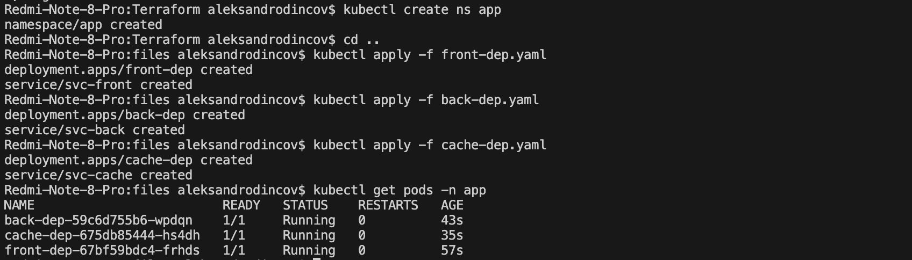
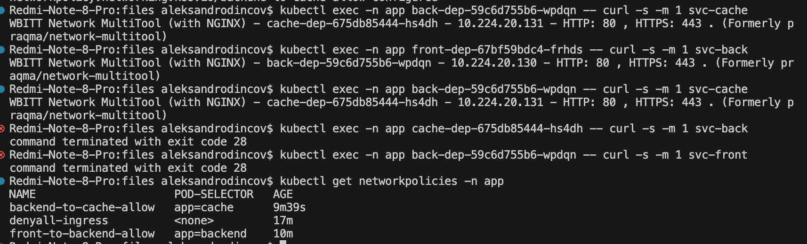

# [Домашнее задание к занятию «Как работает сеть в K8s»](https://github.com/netology-code/kuber-homeworks/blob/main/3.3/3.3.md)

### Задание 1. Создать сетевую политику или несколько политик для обеспечения доступа

1. Создать deployment'ы приложений frontend, backend и cache и соответсвующие сервисы.
```
apiVersion: apps/v1
kind: Deployment
metadata:
  name: front-dep
  namespace: app
  labels:
    app: frontend
spec:
  selector:
    matchLabels:
      app: frontend
  template:
    metadata:
      labels:
        app: frontend
    spec:
      containers:
        - name: multitool
          image: wbitt/network-multitool
          ports:
            - containerPort: 80
---
apiVersion: v1
kind: Service
metadata:
  name: svc-front
  namespace: app
spec:
  selector:
    app: frontend
  ports:
    - name: multitool-port
      protocol: TCP
      port: 80
      targetPort: 80
  type: ClusterIP
```

2. В качестве образа использовать network-multitool.
3. Разместить поды в namespace App.

<p align="center">
  
</p>
4. Создать политики, чтобы обеспечить доступ frontend -> backend -> cache. Другие виды подключений должны быть запрещены.

```
apiVersion: networking.k8s.io/v1
kind: NetworkPolicy
metadata:
  name: front-to-backend-allow
  namespace: app
spec:
  podSelector:
    matchLabels:
      app: backend
  policyTypes:
    - Ingress
  ingress:
    - from:
        - podSelector:
            matchLabels:
              app: frontend
      ports:
        - protocol: TCP
          port: 80
---
apiVersion: networking.k8s.io/v1
kind: NetworkPolicy
metadata:
  name: backend-to-cache-allow
  namespace: app
spec:
  podSelector:
    matchLabels:
      app: cache
  policyTypes:
    - Ingress
  ingress:
    - from:
        - podSelector:
            matchLabels:
              app: backend
      ports:
        - protocol: TCP
          port: 80
```

<p align="center">
  
</p>

5. Продемонстрировать, что трафик разрешён и запрещён.

<p align="center">
  
</p>