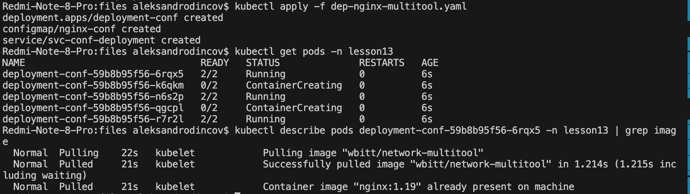
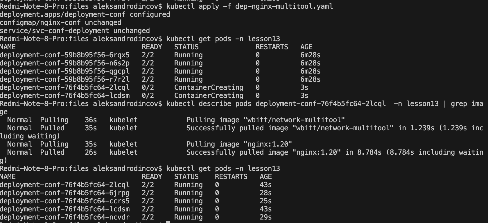
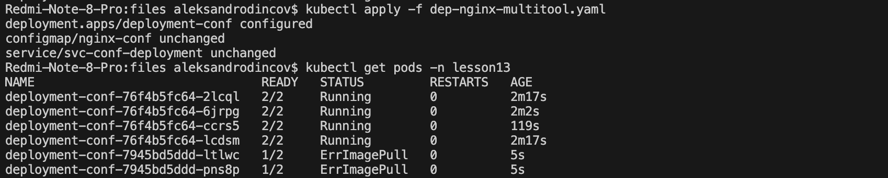
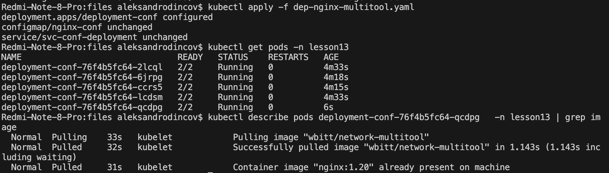

# [Домашнее задание к занятию «Обновление приложений»](https://github.com/netology-code/kuber-homeworks/blob/main/3.4/3.4.md)

### Задание 1. Выбрать стратегию обновления приложения и описать ваш выбор

1. Имеется приложение, состоящее из нескольких реплик, которое требуется обновить.
2. Ресурсы, выделенные для приложения, ограничены, и нет возможности их увеличить.
3. Запас по ресурсам в менее загруженный момент времени составляет 20%.
4. Обновление мажорное, новые версии приложения не умеют работать со старыми.
5. Вам нужно объяснить свой выбор стратегии обновления приложения.

Мой выбор это Rolling update , учитывая, что у вас есть 20% запаса по ресурсам в менее загруженный момент времени, Rolling Update позволит нам контролировать нагрузку на ресурсы при обновлении приложения, предотвращая возможные сбои из-за нехватки ресурсов и обеспечивая плавное обновление без значительного простоя приложения.

### Задание 2. Обновить приложение

1. Создать deployment приложения с контейнерами nginx и multitool. Версию nginx взять 1.19. Количество реплик — 5.
```
apiVersion: apps/v1
kind: Deployment
metadata:
  name: deployment-conf
  namespace: lesson13
  labels:
    app: update
spec:
  replicas: 5
  selector:
    matchLabels:
      app: update
  template:
    metadata:
      labels:
        app: update
    spec:
      containers:
        - name: multitool
          image: wbitt/network-multitool
          ports:
            - containerPort: 80
        - name: nginx
          image: nginx:1.19
          ports:
            - containerPort: 8080
          volumeMounts:
            - name: nginx-conf
              mountPath: /etc/nginx/conf.d
          env:
            - name: HTTP_PORT
              value: "8080"
      volumes:
        - name: nginx-conf
          configMap:
            name: nginx-conf
```

<p align="center">
  
</p>

2. Обновить версию nginx в приложении до версии 1.20, сократив время обновления до минимума. Приложение должно быть доступно.
```
spec:
  replicas: 5
  revisionHistoryLimit: 10
  strategy:
    type: RollingUpdate
    rollingUpdate:
      maxSurge: 1
      maxUnavailable: 1
```

<p align="center">
  
</p>

3. Попытаться обновить nginx до версии 1.28, приложение должно оставаться доступным.

<p align="center">
  
</p>

4. Откатиться после неудачного обновления.

<p align="center">
  
</p>

