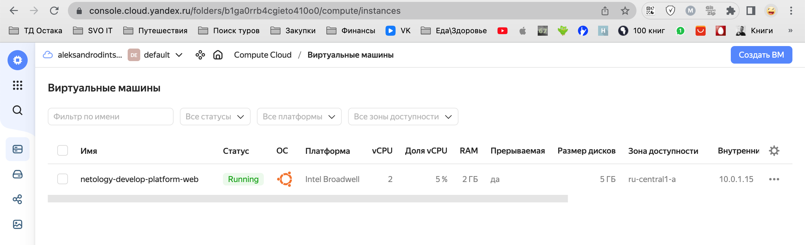
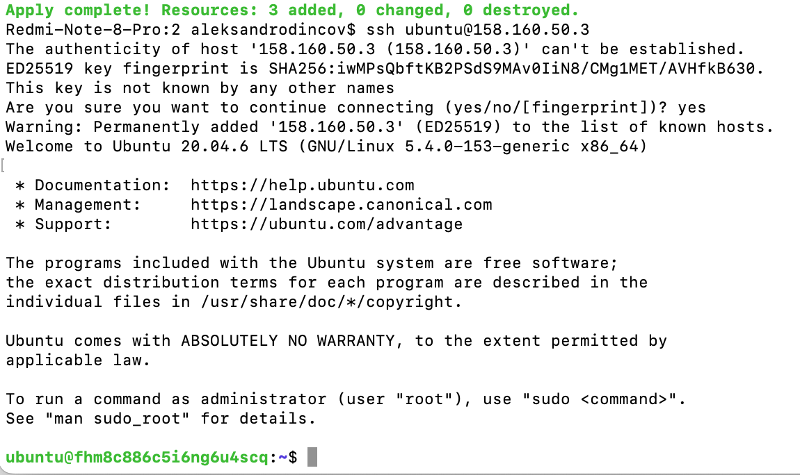

### Задание 1
В качестве ответа всегда полностью прикладываете ваш terraform-код в git!

1. Изучите проект. В файле variables.tf объявлены переменные для yandex provider.
2. Переименуйте файл personal.auto.tfvars_example в personal.auto.tfvars. Заполните переменные (идентификаторы облака, токен доступа). Благодаря .gitignore этот файл не попадет в публичный репозиторий. **Вы можете выбрать иной способ безопасно передать секретные данные в terraform.**
3. Сгенерируйте или используйте свой текущий ssh ключ. Запишите его открытую часть в переменную **vms_ssh_root_key**.
4. Инициализируйте проект, выполните код. Исправьте намеренно допущенные синтаксические ошибки. Ищите внимательно, посимвольно. Ответьте в чем заключается их суть? 
5. Ответьте, как в процессе обучения могут пригодиться параметры```preemptible = true``` и ```core_fraction=5``` в параметрах ВМ? Ответ в документации Yandex cloud.


### Ответ 1
main.tf line 15 platform_id = "standart-v4"  - значение переменной может быть только standard-v1/standard-v2/standard-v3 
main.tf line 15 platform_id = "standart-v4"  - ошибка в слове standat  , нужно standard
main.tf line 15  cores         = 1  - количество CPU может быть только 2 или 4 для standart-v1

<p align="center">
  
</p>

<p align="center">
  
</p>

5. 
preemptible = true
Парментр может быть полезный для того что бы при простое ВМ не использовала ресурсы в облаке.
при использовании параметра работа ВМ будет прервана 
* Если с момента запуска виртуальной машины прошло 24 часа.
* Если возникнет нехватка ресурсов для запуска обычной виртуальной машины в той же зоне доступности. Вероятность такого события низкая, но может меняться изо дня в день.

core_fraction=5
Параметр может быть полезен для разграничения ресурсов между созданными ВМ 

### Задание 4

1. Объявите в файле outputs.tf output типа map, содержащий { instance_name = external_ip } для каждой из ВМ.
2. Примените изменения.

### Ответ 4

```
Redmi-Note-8-Pro:2 aleksandrodincov$ terraform output
external_ip-bd = "158.160.104.1"
external_ip_web = "130.193.36.184"
```


### Задание 7*

Изучите содержимое файла console.tf. Откройте terraform console, выполните следующие задания: 

1. Напишите, какой командой можно отобразить **второй** элемент списка test_list?
2. Найдите длину списка test_list с помощью функции length(<имя переменной>).
3. Напишите, какой командой можно отобразить значение ключа admin из map test_map ?
4. Напишите interpolation выражение, результатом которого будет: "John is admin for production server based on OS ubuntu-20-04 with X vcpu, Y ram and Z virtual disks", используйте данные из переменных test_list, test_map, servers и функцию length() для подстановки значений.

В качестве решения предоставьте необходимые команды и их вывод.

### Ответ 7
1. 
```
> local.test_list[1]
"staging"
```
2.
```
> length(local.test_list)
3
```
3.
```
> local.test_map.admin
"John"
```
4.
```
> "${local.test_map.admin} is admin  for ${local.test_list[2]} server based on OS ${local.servers.production.image}  with ${local.servers.production.cpu}  vcpu, ${local.servers.production.ram} ram and ${length(local.servers.production.disks)} virtual disks "
"John is admin  for production server based on OS ubuntu-20-04  with 10  vcpu, 40 ram and 4 virtual disks "

```