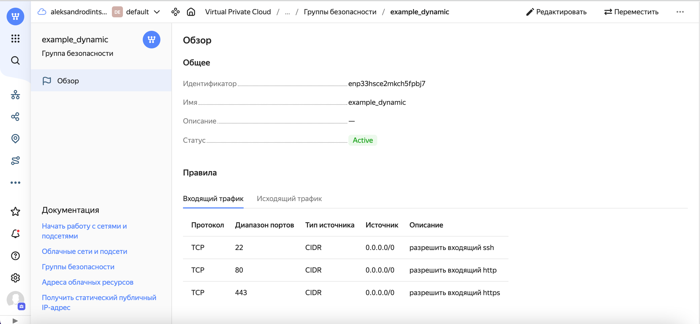
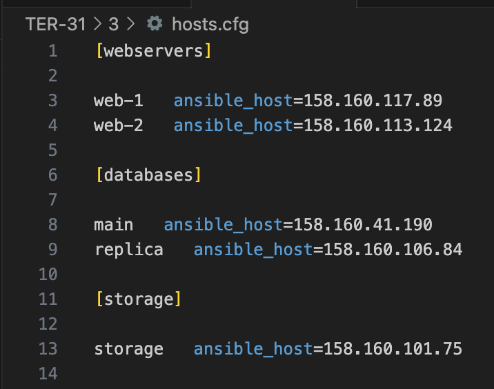

### Задание 1

1. Изучите проект.
2. Заполните файл personal.auto.tfvars.
3. Инициализируйте проект, выполните код. Он выполнится, даже если доступа к preview нет.

Примечание. Если у вас не активирован preview-доступ к функционалу «Группы безопасности» в Yandex Cloud, запросите доступ у поддержки облачного провайдера. Обычно его выдают в течение 24-х часов.

Приложите скриншот входящих правил «Группы безопасности» в ЛК Yandex Cloud или скриншот отказа в предоставлении доступа к preview-версии.

------

### Ответ 1

<p align="center">
  
</p>

### Задание 2

1. Создайте файл count-vm.tf. Опишите в нём создание двух **одинаковых** ВМ  web-1 и web-2 (не web-0 и web-1) с минимальными параметрами, используя мета-аргумент **count loop**. Назначьте ВМ созданную в первом задании группу безопасности.(как это сделать узнайте в документации провайдера yandex/compute_instance )
```
resource "yandex_compute_instance" "platform" {
  name        = "web-${count.index + 1}"
  platform_id = "standard-v1"
  
  count = 2

  resources {
    cores  = 2
    memory = 1
    core_fraction = 20
  }
  boot_disk {
    initialize_params {
      image_id = data.yandex_compute_image.ubuntu-2004-lts.image_id
      type = "network-hdd"
      size = 5
    }   
  }
```
```
network_interface { 
    subnet_id = yandex_vpc_subnet.develop.id
    nat       = true

    security_group_ids = [yandex_vpc_security_group.example.id]
}
```
2. Создайте файл for_each-vm.tf. Опишите в нём создание двух ВМ с именами "main" и "replica" **разных** по cpu/ram/disk , используя мета-аргумент **for_each loop**. Используйте для обеих ВМ одну общую переменную типа list(object({ vm_name=string, cpu=number, ram=number, disk=number  })). При желании внесите в переменную все возможные параметры.

```
resource "yandex_compute_instance" "web" {
    for_each = { for key ,value in var.vm_resources : key => value}
    name = each.value.name
    platform_id = each.value.platform_id 
    resources {
        cores  = each.value.cores 
        memory = each.value.memory 
        core_fraction = each.value.core_fraction
    }

  boot_disk {
    initialize_params {
    image_id  = data.yandex_compute_image.ubuntu-2004-lts.image_id
      type = each.value.type
      size = each.value.size
    }   
  }
}

```

```
variable "vm_resources"{
type = list(object(
    {
    name        = string
    platform_id  = string
    cores        = number
    memory        = number
    core_fraction = number
    type          = string
    size        = number
    }))
      default = [
    { 
    name        = "main"
    platform_id = "standatd-v1"
    cores        = 2
    memory        = 2
    core_fraction = 50
    type          = "network-hdd"
    size        = 7
    },
    {
     name       = "replica"
    platform_id = "standatd-v1"
    cores        = 2
    memory        = 1
    core_fraction = 20
    type          = "network-hdd"
    size        = 5
    }
  ]
}
``````
3. ВМ из пункта 2.2 должны создаваться после создания ВМ из пункта 2.1.
```
resource "yandex_compute_instance" "web" {
    depends_on = [yandex_compute_instance.platform]
}
```
4. Используйте функцию file в local-переменной для считывания ключа ~/.ssh/id_rsa.pub и его последующего использования в блоке metadata, взятому из ДЗ 2.
```
locals {
 ssh-key = file("~/.ssh/id_ed25519.pub")
}
```

### Задание 3

1. Создайте 3 одинаковых виртуальных диска размером 1 Гб с помощью ресурса yandex_compute_disk и мета-аргумента count в файле **disk_vm.tf** .

```
resource "yandex_compute_disk" "disk" {
    count = 3
  name       = "disk-${count.index + 1}"
  type       = "network-hdd"
  zone       = var.default_zone
  size       = 10
}
```

2. Создайте в том же файле одну ВМ c именем "storage" . Используйте блок **dynamic secondary_disk{..}** и мета-аргумент for_each для подключения созданных вами дополнительных дисков.

```
resource "yandex_compute_instance" "storage" {
  name        = "storage"
  platform_id = "standard-v1"
  resources {
    cores  = 2
    memory = 1
    core_fraction = 20
  }
  boot_disk {
    initialize_params {
      image_id = data.yandex_compute_image.ubuntu-2004-lts.image_id
      type = "network-hdd"
      size = 5
    }   
  }
  metadata = {
    ssh-keys = "ubuntu:${local.ssh-key}"
  }

  
  dynamic "secondary_disk" {
    for_each = yandex_compute_disk.disk.*.id
    content {
      disk_id = secondary_disk.value
    }
  }
  network_interface { 
    subnet_id = yandex_vpc_subnet.develop.id
    nat       = true

    security_group_ids = [yandex_vpc_security_group.example.id]
  }
}
```


### Задание 4

1. В файле ansible.tf создайте inventory-файл для ansible.
Используйте функцию tepmplatefile и файл-шаблон для создания ansible inventory-файла из лекции.
Готовый код возьмите из демонстрации к лекции [**demonstration2**](https://github.com/netology-code/ter-homeworks/tree/main/demonstration2).
Передайте в него в качестве переменных группы виртуальных машин из задания 2.1, 2.2 и 3.2, т. е. 5 ВМ.

```
resource "local_file" "hosts_cfg" {
  content = templatefile("${path.module}/hosts.tftpl",
    {
       webservers =  yandex_compute_instance.platform 
       databases = yandex_compute_instance.web  
       storage = yandex_compute_instance.storage
    }
  )
  filename = "${abspath(path.module)}/hosts.cfg"
}
```
2. Инвентарь должен содержать 3 группы [webservers], [databases], [storage] и быть динамическим, т. е. обработать как группу из 2-х ВМ, так и 999 ВМ.

4. Выполните код. Приложите скриншот получившегося файла. 

<p align="center">
  
</p>


