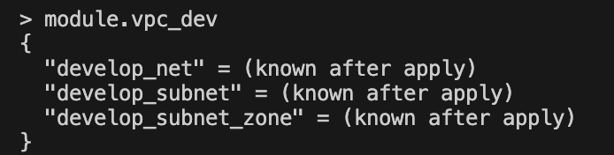
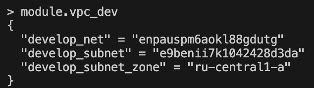

### Задание 1

1. Возьмите из [демонстрации к лекции готовый код](https://github.com/netology-code/ter-homeworks/tree/main/04/demonstration1) для создания ВМ с помощью remote-модуля.
2. Создайте одну ВМ, используя этот модуль. В файле cloud-init.yml необходимо использовать переменную для ssh-ключа вместо хардкода. Передайте ssh-ключ в функцию template_file в блоке vars ={} .

```
users:
  - name: ubuntu
    groups: sudo
    shell: /bin/bash
    sudo: ["ALL=(ALL) NOPASSWD:ALL"]
    ssh_authorized_keys:
      - ${ssh_public_key}

  ```

Воспользуйтесь [**примером**](https://grantorchard.com/dynamic-cloudinit-content-with-terraform-file-templates/). Обратите внимание, что ssh-authorized-keys принимает в себя список, а не строку.
3. Добавьте в файл cloud-init.yml установку nginx.
```
packages:
  - vim
  - nginx
  ```

4. Предоставьте скриншот подключения к консоли и вывод команды ```sudo nginx -t```.

<p align="center">
  
</p>


### Задание 2

1. Напишите локальный модуль vpc, который будет создавать 2 ресурса: **одну** сеть и **одну** подсеть в зоне, объявленной при вызове модуля, например: ```ru-central1-a```.

```
resource "yandex_vpc_network" "develop_net" {
  name = var.vpc_name
}
resource "yandex_vpc_subnet" "develop_subnet" {
  name           = var.vpc_subnet_name
  zone           = var.zone
  network_id     = yandex_vpc_network.develop_net.id
  v4_cidr_blocks = var.cidr
}
````
2. Вы должны передать в модуль переменные с названием сети, zone и v4_cidr_blocks.
```
module "vpc_dev" {
  source       = "./vpc"
  vpc_name        = "net"
  vpc_subnet_name     = "subnet"
  zone = "ru-central1-a"
  cidr = "10.0.1.0/24"
}
```
3. Модуль должен возвращать в root module с помощью output информацию о yandex_vpc_subnet. Пришлите скриншот информации из terraform console о своем модуле. Пример: > module.vpc_dev  

<p align="center">
  
</p>

4. Замените ресурсы yandex_vpc_network и yandex_vpc_subnet созданным модулем. Не забудьте передать необходимые параметры сети из модуля vpc в модуль с виртуальной машиной.
```
Redmi-Note-8-Pro:demonstration1 aleksandrodincov$ terraform state list
data.template_file.cloudinit
yandex_vpc_network.develop
yandex_vpc_subnet.develop
module.test-vm.data.yandex_compute_image.my_image
module.test-vm.yandex_compute_instance.vm[0]
module.test-vm.yandex_compute_instance.vm[1]
```

```
Redmi-Note-8-Pro:demonstration1 aleksandrodincov$ terraform state list
data.template_file.cloudinit
module.test-vm.data.yandex_compute_image.my_image
module.test-vm.yandex_compute_instance.vm[0]
module.test-vm.yandex_compute_instance.vm[1]
module.vpc_dev.yandex_vpc_network.develop_net
module.vpc_dev.yandex_vpc_subnet.develop_subnet
```

5. Откройте terraform console и предоставьте скриншот содержимого модуля. Пример: > module.vpc_dev.
<p align="center">
  
</p>

6. Сгенерируйте документацию к модулю с помощью terraform-docs..</br>
[doc_vpc_dev.md](./doc_vpc_dev.md)

### Задание 3
1. Выведите список ресурсов в стейте.
```
Redmi-Note-8-Pro:demonstration1 aleksandrodincov$ terraform state list
data.template_file.cloudinit
module.test-vm.data.yandex_compute_image.my_image
module.test-vm.yandex_compute_instance.vm[0]
module.test-vm.yandex_compute_instance.vm[1]
module.vpc_dev.yandex_vpc_network.develop_net
module.vpc_dev.yandex_vpc_subnet.develop_subnet
```
2. Полностью удалите из стейта модуль vpc.
```
Redmi-Note-8-Pro:demonstration1 aleksandrodincov$ terraform state rm module.vpc_dev
Removed module.vpc_dev.yandex_vpc_network.develop_net
Removed module.vpc_dev.yandex_vpc_subnet.develop_subnet
Successfully removed 2 resource instance(s).
```
3. Полностью удалите из стейта модуль vm.
```
Redmi-Note-8-Pro:demonstration1 aleksandrodincov$ terraform state rm module.test-vm
Removed module.test-vm.data.yandex_compute_image.my_image
Removed module.test-vm.yandex_compute_instance.vm[0]
Removed module.test-vm.yandex_compute_instance.vm[1]
Successfully removed 3 resource instance(s).
```
4. Импортируйте всё обратно. Проверьте terraform plan. Изменений быть не должно.
Приложите список выполненных команд и скриншоты процессы.
```
Redmi-Note-8-Pro:demonstration1 aleksandrodincov$ terraform import 'module.vpc_dev.yandex_vpc_network.develop_net' enpauspm6aokl88gdutg
```
<p align="center">
  
</p>

```
Redmi-Note-8-Pro:demonstration1 aleksandrodincov$ terraform import 'module.vpc_dev.yandex_vpc_subnet.develop_subnet' e9benii7k1042428d3da
```
<p align="center">
  
</p>

```
Redmi-Note-8-Pro:demonstration1 aleksandrodincov$ terraform import 'module.test-vm.yandex_compute_instance.vm[0]' fhm596d64gqd6ubh6h7s
```
<p align="center">
  
</p>

```
Redmi-Note-8-Pro:demonstration1 aleksandrodincov$ terraform import 'module.test-vm.yandex_compute_instance.vm[1]' fhmojt9votmvopushbl3
```
<p align="center">
  
</p>

```
terraform plan 
```
<p align="center">
  
</p>
