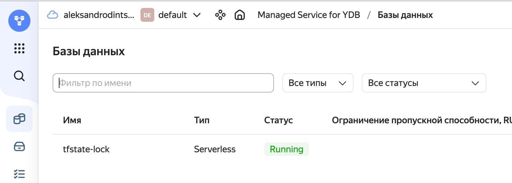
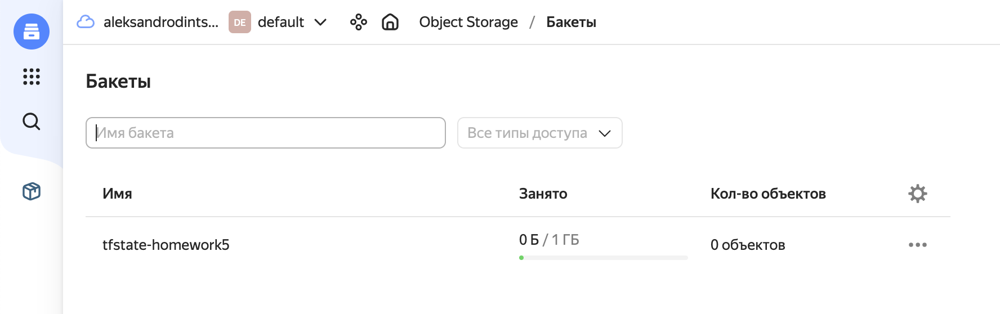
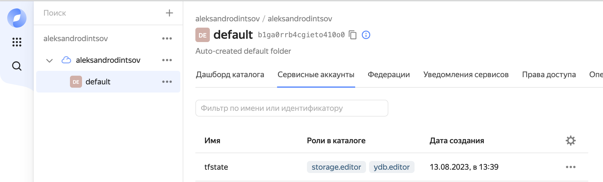
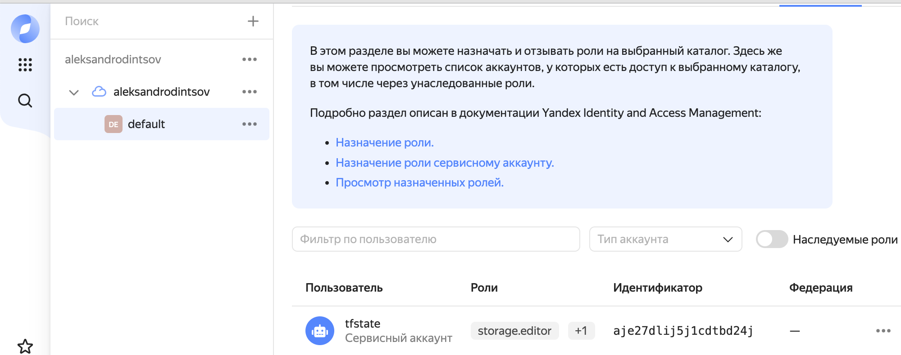
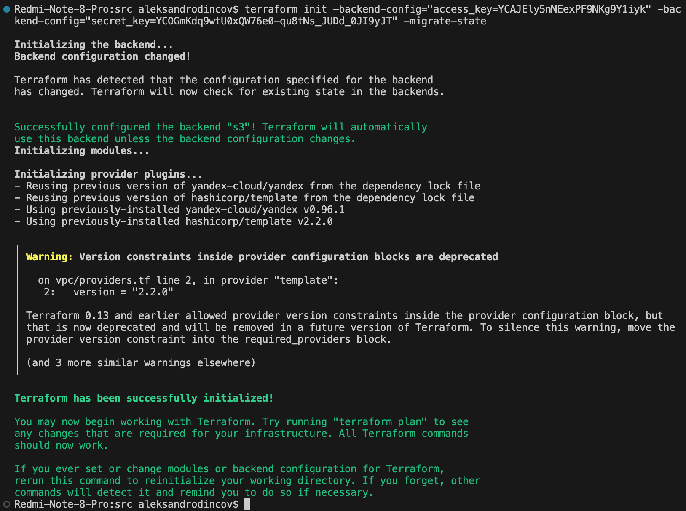
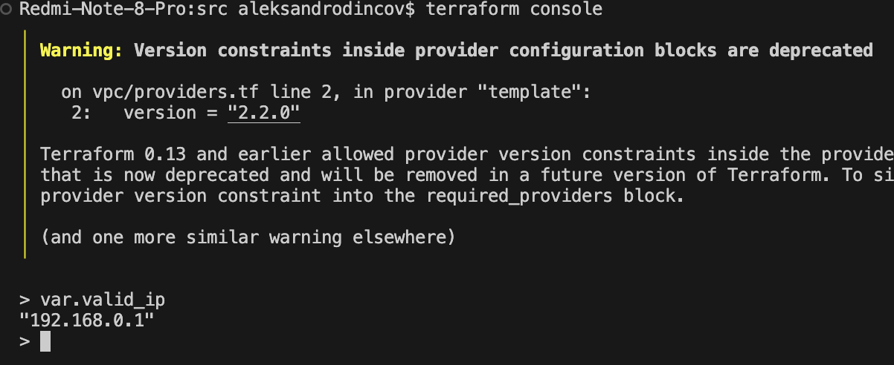
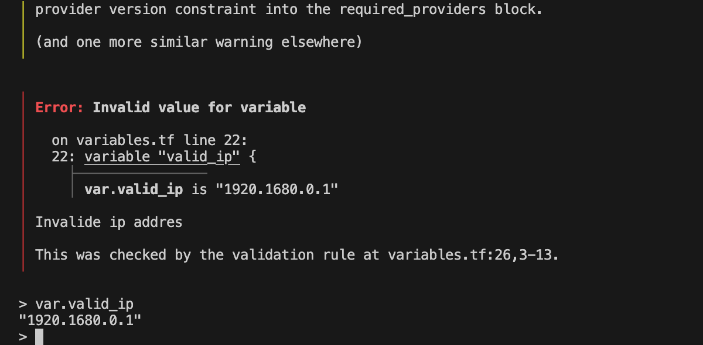
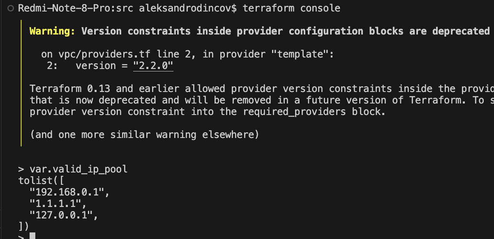
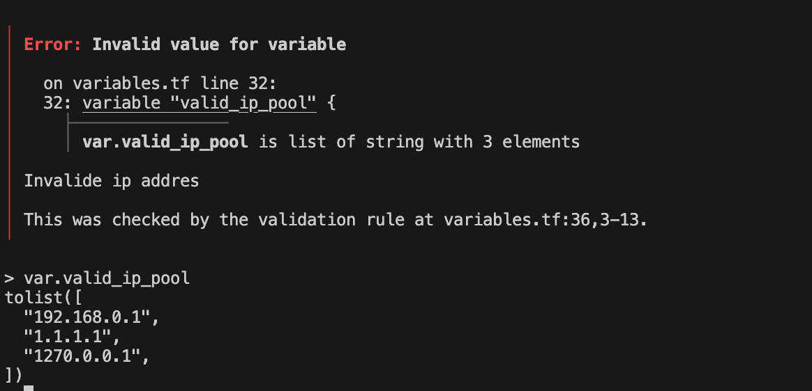

### Задание 1

1. Возьмите код:
- из [ДЗ к лекции 4](https://github.com/netology-code/ter-homeworks/tree/main/04/src),
- из [демо к лекции 4](https://github.com/netology-code/ter-homeworks/tree/main/04/demonstration1).
2. Проверьте код с помощью tflint 

```
Warning: Module source "git::https://github.com/udjin10/yandex_compute_instance.git?ref=main" uses a default branch as ref (main) (terraform_module_pinned_source)

  on main.tf line 33:
  33:   source          = "git::https://github.com/udjin10/yandex_compute_instance.git?ref=main"
```
Модуль использует ветку main по умолчанию 

```

Warning: Missing version constraint for provider "yandex" in `required_providers` (terraform_required_providers)

  on providers.tf line 3:
   3:     yandex = {
   4:       source = "yandex-cloud/yandex"
   5:     }

Reference: https://github.com/terraform-linters/tflint-ruleset-terraform/blob/v0.4.0/docs/rules/terraform_required_providers.md
```
Отсутствует ограничение версии для провайдера 

```
Warning: [Fixable] variable "vms_ssh_root_key" is declared but not used (terraform_unused_declarations)

  on variables.tf line 36:
  36: variable "vms_ssh_root_key" {

Reference: https://github.com/terraform-linters/tflint-ruleset-terraform/blob/v0.4.0/docs/rules/terraform_unused_declarations.md
```
переменна обьявлена , но не используется 


и checkov. Вам не нужно инициализировать этот проект.

```
Check: CKV_YC_11: "Ensure security group is assigned to network interface."
        FAILED for resource: module.test-vm.yandex_compute_instance.vm[0]
        File: /.external_modules/github.com/udjin10/yandex_compute_instance/main/main.tf:24-73
        Calling File: /main.tf:32-48
        
```

не назначена группа безопасности 
```
heck: CKV_YC_2: "Ensure compute instance does not have public IP."
        FAILED for resource: module.test-vm.yandex_compute_instance.vm[0]
        File: /.external_modules/github.com/udjin10/yandex_compute_instance/main/main.tf:24-73
        Calling File: /main.tf:32-48
```

Убедиться что ВМ не имеет публичного IP 

```
Check: CKV_TF_1: "Ensure Terraform module sources use a commit hash"
        FAILED for resource: test-vm
        File: /main.tf:32-48

                32 | module "test-vm" {
                33 |   source          = "git::https://github.com/udjin10/yandex_compute_instance.git?ref=main"
                34 |   env_name        = "develop"
                35 |   network_id      = yandex_vpc_network.develop.id
                36 |   subnet_zones    = ["ru-central1-a"]
                37 |   subnet_ids      = [ yandex_vpc_subnet.develop.id ]
                38 |   instance_name   = "web"
                39 |   instance_count  = 2
                40 |   image_family    = "ubuntu-2004-lts"
                41 |   public_ip       = true
                42 |   
                43 |   metadata = {
                44 |       user-data          = data.template_file.cloudinit.rendered #Для демонстрации №3
                45 |       serial-port-enable = 1
                46 |   }
                47 | 
                48 | }
```
проверить что в модуле используется хэш коммита 


3. Перечислите, какие **типы** ошибок обнаружены в проекте (без дублей).

### Задание 2

1. Возьмите ваш GitHub-репозиторий с **выполненным ДЗ 4** в ветке 'terraform-04' и сделайте из него ветку 'terraform-05'.
```
Redmi-Note-8-Pro:TER-31 aleksandrodincov$ sudo git switch -c terraform-05
Переключились на новую ветку «terraform-05»
```
2. Повторите демонстрацию лекции: 
настройте YDB
<p align="center">
  
</p>
S3 bucket
<p align="center">
  
</p>
yandex service account
<p align="center">
  
</p>

права доступа

<p align="center">
  
</p>

мигрируйте state проекта в S3 с блокировками.
<p align="center">
  
</p>


 Предоставьте скриншоты процесса в качестве ответа.
3. Закоммитьте в ветку 'terraform-05' все изменения.
```
Redmi-Note-8-Pro:TER-31 aleksandrodincov$ sudo git commit -m "Taks 2"
[terraform-05 c298847] Taks 2
 28 files changed, 149 insertions(+), 206 deletions(-)
```
4. Откройте в проекте terraform console, а в другом окне из этой же директории попробуйте запустить terraform apply.
5. Пришлите ответ об ошибке доступа к state.

```
Redmi-Note-8-Pro:src aleksandrodincov$ terraform apply
Acquiring state lock. This may take a few moments...
╷
│ Error: Error acquiring the state lock
│ 
│ Error message: ConditionalCheckFailedException: Condition not satisfied
│ Lock Info:
│   ID:        86de7eef-e059-3839-b672-3bff97ddc8ae
│   Path:      tfstate-homework5/terraform.tfstate
│   Operation: OperationTypeInvalid
│   Who:       aleksandrodincov@Redmi-Note-8-Pro.local
│   Version:   1.5.2
│   Created:   2023-08-13 12:03:44.066092 +0000 UTC
│   Info:      
│ 
│ 
│ Terraform acquires a state lock to protect the state from being written
│ by multiple users at the same time. Please resolve the issue above and try
│ again. For most commands, you can disable locking with the "-lock=false"
│ flag, but this is not recommended.
```
6. Принудительно разблокируйте state. 
Пришлите команду
```
terraform force-unlock 86de7eef-e059-3839-b672-3bff97ddc8ae
``` 
и вывод.
```
Do you really want to force-unlock?
  Terraform will remove the lock on the remote state.
  This will allow local Terraform commands to modify this state, even though it
  may still be in use. Only 'yes' will be accepted to confirm.

  Enter a value: yes

Terraform state has been successfully unlocked!

The state has been unlocked, and Terraform commands should now be able to
obtain a new lock on the remote state.
``

### Задание 3  

1. Сделайте в GitHub из ветки 'terraform-05' новую ветку 'terraform-hotfix'.
```
Redmi-Note-8-Pro:TER-31 aleksandrodincov$ sudo git switch -c terraform-hotfix
Password:
Переключились на новую ветку «terraform-hotfix»
```
2. Проверье код с помощью tflint и checkov, исправьте все предупреждения и ошибки в 'terraform-hotfix', сделайте коммит.
3. Откройте новый pull request 'terraform-hotfix' --> 'terraform-05'. 
4. Вставьте в комментарий PR результат анализа tflint и checkov, план изменений инфраструктуры из вывода команды terraform plan.
5. Пришлите ссылку на PR для ревью. Вливать код в 'terraform-05' не нужно.
[Pull Request 'terraform-hotfix' --> 'terraform-05'](https://github.com/AleksandrOdintsov/devops-netology/pull/1)

### Задание 4

1. Напишите переменные с валидацией и протестируйте их, заполнив default верными и неверными значениями. Предоставьте скриншоты проверок из terraform console. 

- type=string, description="ip-адрес" — проверка, что значение переменной содержит верный IP-адрес с помощью функций cidrhost() или regex(). Тесты:  "192.168.0.1" и "1920.1680.0.1"

<p align="center">
  
</p>
<p align="center">
  
</p>


- type=list(string), description="список ip-адресов" — проверка, что все адреса верны. Тесты:  ["192.168.0.1", "1.1.1.1", "127.0.0.1"] и ["192.168.0.1", "1.1.1.1", "1270.0.0.1"].
<p align="center">
  
</p>
<p align="center">
  
</p>