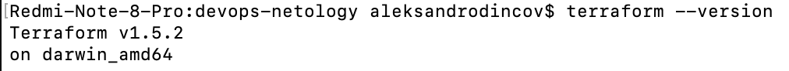
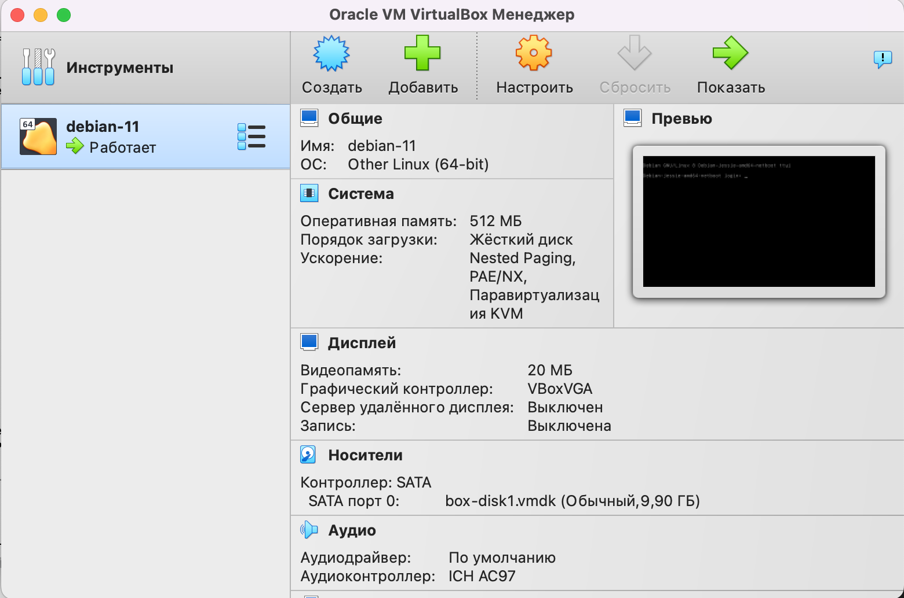

### Чеклист готовности к домашнему заданию

1. Скачайте и установите актуальную версию **terraform** >=1.4.X . Приложите скриншот вывода команды ```terraform --version```.
2. Скачайте на свой ПК данный git репозиторий. Исходный код для выполнения задания расположен в директории **01/src**.
3. Убедитесь, что в вашей ОС установлен docker.


<p align="center">
  
</p>

### Задание 1
1. Перейдите в каталог [**src**](https://github.com/netology-code/ter-homeworks/tree/main/01/src). Скачайте все необходимые зависимости, использованные в проекте. 
2. Изучите файл **.gitignore**. В каком terraform файле согласно этому .gitignore допустимо сохранить личную, секретную информацию?
3. Выполните код проекта. Найдите  в State-файле секретное содержимое созданного ресурса **random_password**, пришлите в качестве ответа конкретный ключ и его значение.
4. Раскомментируйте блок кода, примерно расположенный на строчках 29-42 файла **main.tf**.
Выполните команду ```terraform validate```. Объясните в чем заключаются намеренно допущенные ошибки? Исправьте их.
5. Выполните код. В качестве ответа приложите вывод команды ```docker ps```
6. Замените имя docker-контейнера в блоке кода на ```hello_world```, выполните команду ```terraform apply -auto-approve```.
Объясните своими словами, в чем может быть опасность применения ключа  ```-auto-approve``` ? В качестве ответа дополнительно приложите вывод команды ```docker ps```
8. Уничтожьте созданные ресурсы с помощью **terraform**. Убедитесь, что все ресурсы удалены. Приложите содержимое файла **terraform.tfstate**. 
9. Объясните, почему при этом не был удален docker образ **nginx:latest** ? Ответ подкрепите выдержкой из документации провайдера.

### Ответ 1
1. Перейдите в каталог [**src**](https://github.com/netology-code/ter-homeworks/tree/main/01/src). Скачайте все необходимые зависимости, использованные в проекте. 
2. Изучите файл **.gitignore**. В каком terraform файле согласно этому .gitignore допустимо сохранить личную, секретную информацию?

./personal.auto.tfvars

3. Выполните код проекта. Найдите  в State-файле секретное содержимое созданного ресурса **random_password**, пришлите в качестве ответа конкретный ключ и его значение.

yAzhgIJl4dqCxF1e

4. Раскомментируйте блок кода, примерно расположенный на строчках 29-42 файла **main.tf**.
Выполните команду ```terraform validate```. Объясните в чем заключаются намеренно допущенные ошибки? Исправьте их.


#строка 29 - имя должно начинаться с букры или нижнего подчеркивания 

#строка 30 - ранее не был обявленн модуль "docker_image" т.к. строки 23-28 закоментированны 

#строка 31 - использвано не верное имя ранее обьявленного модуля 

#строка 24 - не указано имя в блоке resource

5. Выполните код. В качестве ответа приложите вывод команды ```docker ps```

```
Redmi-Note-8-Pro:TER-31 aleksandrodincov$ docker ps
CONTAINER ID   IMAGE          COMMAND                  CREATED              STATUS              PORTS                  NAMES
913e793d83a2   021283c8eb95   "/docker-entrypoint.…"   About a minute ago   Up About a minute   0.0.0.0:8000->80/tcp   example_yAzhgIJl4dqCxF1e
```

6. Замените имя docker-контейнера в блоке кода на ```hello_world```, выполните команду ```terraform apply -auto-approve```.
Объясните своими словами, в чем может быть опасность применения ключа  ```-auto-approve``` ? В качестве ответа дополнительно приложите вывод команды ```docker ps```

-auto-approve - отключает вывод ранее одобренного плана , из за этого мы не можем быть уверены в том что конкретно что именно будет осуществлять terraform  

```
Redmi-Note-8-Pro:TER-31 aleksandrodincov$ docker ps
CONTAINER ID   IMAGE          COMMAND                  CREATED          STATUS          PORTS                  NAMES
d9ca6898c7a1   021283c8eb95   "/docker-entrypoint.…"   21 seconds ago   Up 20 seconds   0.0.0.0:8000->80/tcp   hello_world
```

7. Уничтожьте созданные ресурсы с помощью **terraform**. Убедитесь, что все ресурсы удалены. Приложите содержимое файла **terraform.tfstate**. 

```
Redmi-Note-8-Pro:TER-31 aleksandrodincov$ cat terraform.tfstate
{
  "version": 4,
  "terraform_version": "1.5.2",
  "serial": 11,
  "lineage": "e63fc8b0-72e8-0b57-b703-7ec0900ed698",
  "outputs": {},
  "resources": [],
  "check_results": null
}
```
8. Объясните, почему при этом не был удален docker образ **nginx:latest** ? Ответ подкрепите выдержкой из документации провайдера.

keep_locally (Boolean) If true, then the Docker image won't be deleted on destroy operation. If this is false, it will delete the image from the docker local storage on destroy operation.

### Задание 2*

1. Изучите в документации provider [**Virtualbox**](https://docs.comcloud.xyz/providers/shekeriev/virtualbox/latest/docs) от 
shekeriev.
2. Создайте с его помощью любую виртуальную машину. Чтобы не использовать VPN советуем выбрать любой образ с расположением в github из [**списка**](https://www.vagrantbox.es/)

В качестве ответа приложите plan для создаваемого ресурса и скриншот созданного в VB ресурса. 


### Ответ 2

<p align="center">
  
</p>
``````
Redmi-Note-8-Pro:2.1 aleksandrodincov$ terraform plan 

Terraform used the selected providers to generate the following execution plan. Resource actions are indicated with the following symbols:
  + create

Terraform will perform the following actions:

  # virtualbox_vm.vm1 will be created
  + resource "virtualbox_vm" "vm1" {
      + cpus   = 1
      + id     = (known after apply)
      + image  = "https://github.com/holms/vagrant-jessie-box/releases/download/Jessie-v0.1/Debian-jessie-amd64-netboot.box"
      + memory = "512 mib"
      + name   = "debian-11"
      + status = "running"

      + network_adapter {
          + device                 = "IntelPro1000MTDesktop"
          + host_interface         = "vboxnet1"
          + ipv4_address           = (known after apply)
          + ipv4_address_available = (known after apply)
          + mac_address            = (known after apply)
          + status                 = (known after apply)
          + type                   = "hostonly"
        }
    }

Plan: 1 to add, 0 to change, 0 to destroy.

Changes to Outputs:
  + IPAddress = (known after apply)

───────────────────────────────────────────────────────────────────────────────────────────────────────────────────────────────────────────────────

Note: You didn't use the -out option to save this plan, so Terraform can't guarantee to take exactly these actions if you run "terraform apply"
now.
```


<p align="center">
  
</p>
