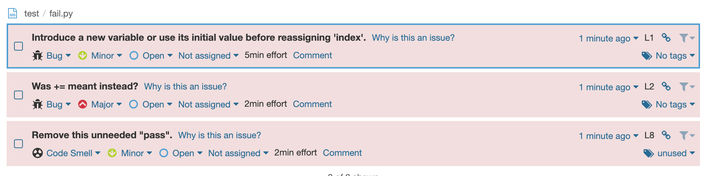
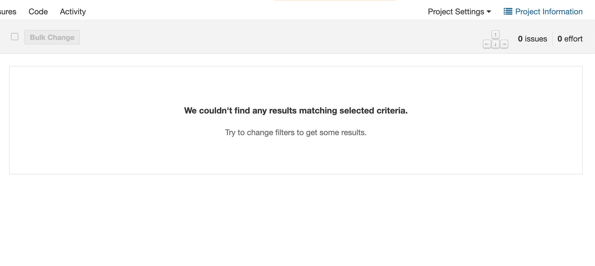
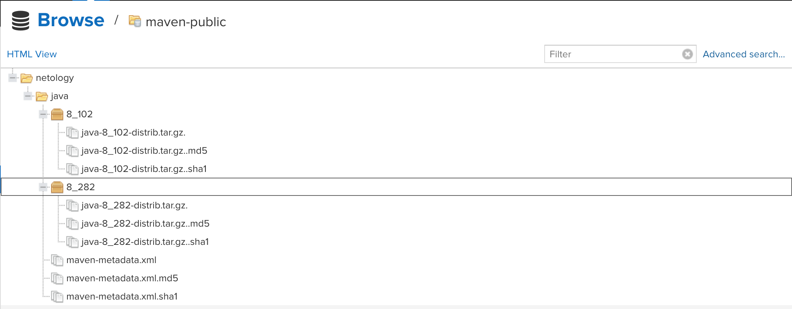
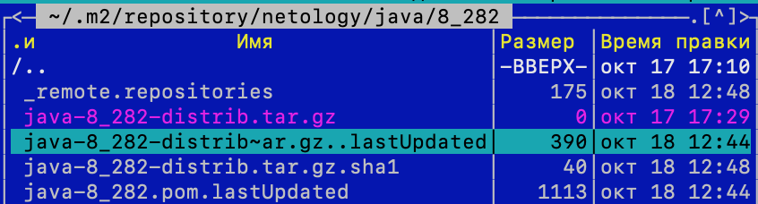

# Домашнее задание к занятию 9 «Процессы CI/CD»

## Знакомоство с SonarQube

### Основная часть

1. Создайте новый проект, название произвольное.
2. Скачайте пакет sonar-scanner, который вам предлагает скачать SonarQube.
3. Сделайте так, чтобы binary был доступен через вызов в shell (или поменяйте переменную PATH, или любой другой, удобный вам способ).
4. Проверьте `sonar-scanner --version`.
```
Redmi-Note-8-Pro:09-ci-02-cicd aleksandrodincov$ sonar-scanner --version
INFO: Scanner configuration file: /Users/aleksandrodincov/devops-netology/09-ci-02-cicd/sonar-scanner-5.0.1.3006-macosx/conf/sonar-scanner.properties
INFO: Project root configuration file: NONE
INFO: SonarScanner 5.0.1.3006
INFO: Java 17.0.7 Eclipse Adoptium (64-bit)
INFO: Mac OS X 12.6.7 x86_64

```
5. Запустите анализатор против кода из директории [example](./src/example/) с дополнительным ключом `-Dsonar.coverage.exclusions=fail.py`.

6. Посмотрите результат в интерфейсе.
<p align="center">
  
</p>
7. Исправьте ошибки, которые он выявил, включая warnings.
8. Запустите анализатор повторно — проверьте, что QG пройдены успешно.
<p align="center">
  
</p>
9. Сделайте скриншот успешного прохождения анализа, приложите к решению ДЗ.

## Знакомство с Nexus

### Основная часть

1. В репозиторий `maven-public` загрузите артефакт с GAV-параметрами:

 *    groupId: netology;
 *    artifactId: java;
 *    version: 8_282;
 *    classifier: distrib;
 *    type: tar.gz.
   
2. В него же загрузите такой же артефакт, но с version: 8_102.
3. Проверьте, что все файлы загрузились успешно.
<p align="center">
  
</p>
4. В ответе пришлите файл `maven-metadata.xml` для этого артефекта.

### Знакомство с Maven

### Подготовка к выполнению

1. Скачайте дистрибутив с [maven](https://maven.apache.org/download.cgi).
2. Разархивируйте, сделайте так, чтобы binary был доступен через вызов в shell (или поменяйте переменную PATH, или любой другой, удобный вам способ).
3. Удалите из `apache-maven-<version>/conf/settings.xml` упоминание о правиле, отвергающем HTTP- соединение — раздел mirrors —> id: my-repository-http-unblocker.
4. Проверьте `mvn --version`.
5. Заберите директорию [mvn](./mvn) с pom.

### Основная часть

1. Поменяйте в `pom.xml` блок с зависимостями под ваш артефакт из первого пункта задания для Nexus (java с версией 8_282).
```
   <repositories>
    <repository>
      <id>my-repo</id>
      <name>maven-public</name>
      <url>http://51.250.93.183/:8081/repository/maven-public/</url>
    </repository>
  </repositories>
  <dependencies>
     <dependency>
      <groupId>netology</groupId>
      <artifactId>java</artifactId>
      <version>8_282</version>
      <classifier>distrib</classifier>
      <type>tar.gz.</type>
    </dependency>
  </dependencies>
</project>
```
2. Запустите команду `mvn package` в директории с `pom.xml`, ожидайте успешного окончания.
```
[INFO] 
[INFO] --- resources:3.3.1:resources (default-resources) @ simple-app ---
[WARNING] Using platform encoding (UTF-8 actually) to copy filtered resources, i.e. build is platform dependent!
[INFO] skip non existing resourceDirectory /Users/aleksandrodincov/devops-netology/09-ci-02-cicd/mvn/src/main/resources
[INFO] 
[INFO] --- compiler:3.11.0:compile (default-compile) @ simple-app ---
[INFO] No sources to compile
[INFO] 
[INFO] --- resources:3.3.1:testResources (default-testResources) @ simple-app ---
[WARNING] Using platform encoding (UTF-8 actually) to copy filtered resources, i.e. build is platform dependent!
[INFO] skip non existing resourceDirectory /Users/aleksandrodincov/devops-netology/09-ci-02-cicd/mvn/src/test/resources
[INFO] 
[INFO] --- compiler:3.11.0:testCompile (default-testCompile) @ simple-app ---
[INFO] No sources to compile
[INFO] 
[INFO] --- surefire:3.1.2:test (default-test) @ simple-app ---
[INFO] No tests to run.
[INFO] 
[INFO] --- jar:3.3.0:jar (default-jar) @ simple-app ---
[WARNING] JAR will be empty - no content was marked for inclusion!
[INFO] Building jar: /Users/aleksandrodincov/devops-netology/09-ci-02-cicd/mvn/target/simple-app-1.0-SNAPSHOT.jar
[INFO] ------------------------------------------------------------------------
[INFO] BUILD SUCCESS
[INFO] ------------------------------------------------------------------------
[INFO] Total time:  2.641 s
[INFO] Finished at: 2023-10-18T12:48:45+03:00
[INFO] ------------------------------------------------------------------------
```
3. Проверьте директорию `~/.m2/repository/`, найдите ваш артефакт.
<p align="center">
  
</p>
4. В ответе пришлите исправленный файл `pom.xml`.

---

### Как оформить решение задания

Выполненное домашнее задание пришлите в виде ссылки на .md-файл в вашем репозитории.

---