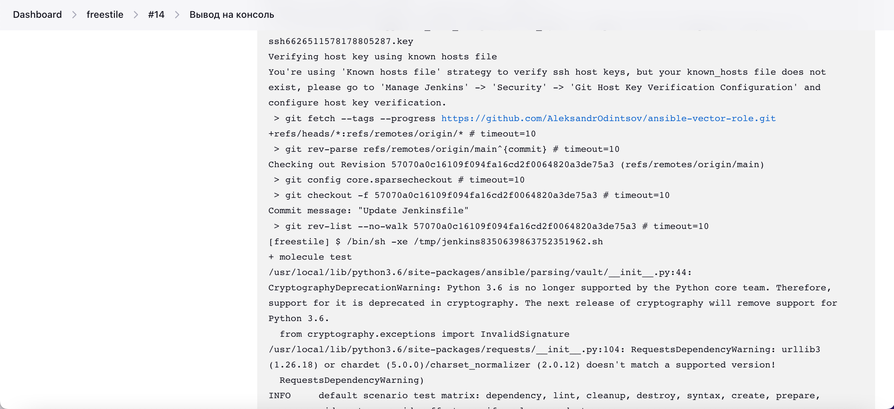
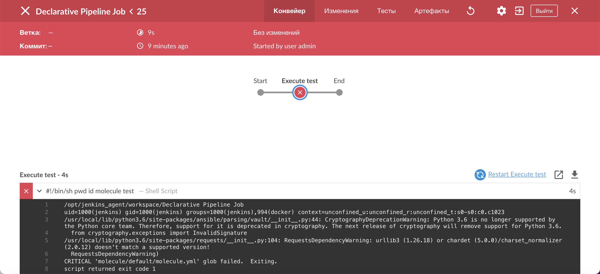
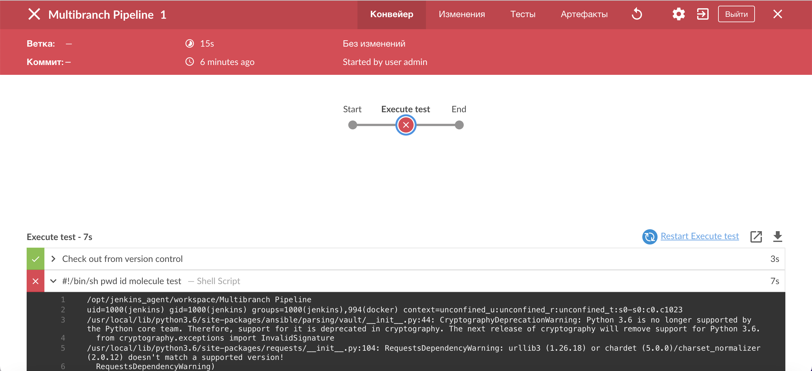
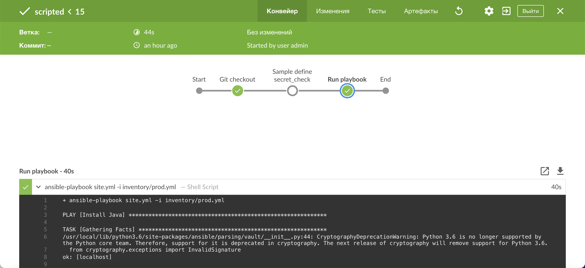
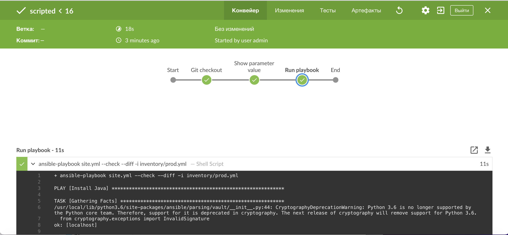

# Домашнее задание к занятию 10 «Jenkins»

## Основная часть

1. Сделать Freestyle Job, который будет запускать `molecule test` из любого вашего репозитория с ролью.

  

2. Сделать Declarative Pipeline Job, который будет запускать `molecule test` из любого вашего репозитория с ролью.

  

3. Перенести Declarative Pipeline в репозиторий в файл `Jenkinsfile`.

[Jenkinsfile](https://github.com/AleksandrOdintsov/ansible-vector-role/blob/main/Jenkinsfile)

4. Создать Multibranch Pipeline на запуск `Jenkinsfile` из репозитория.

  

5. Создать Scripted Pipeline, наполнить его скриптом из [pipeline](./pipeline).

  

6. Внести необходимые изменения, чтобы Pipeline запускал `ansible-playbook` без флагов `--check --diff`, если не установлен параметр при запуске джобы (prod_run = True). По умолчанию параметр имеет значение False и запускает прогон с флагами `--check --diff`.

  

7. Проверить работоспособность, исправить ошибки, исправленный Pipeline вложить в репозиторий в файл `ScriptedJenkinsfile`.

[ScriptedJenkinsfile](https://github.com/AleksandrOdintsov/ansible-vector-role/blob/main/ScriptedJenkinsfile)

8. Отправить ссылку на репозиторий с ролью и Declarative Pipeline и Scripted Pipeline.

[ansible-vector-role](https://github.com/AleksandrOdintsov/ansible-vector-role/tree/main)

[Declarative Pipeline](https://github.com/AleksandrOdintsov/ansible-vector-role/blob/main/Jenkinsfile)

[Scripted Pipeline.](https://github.com/AleksandrOdintsov/ansible-vector-role/blob/main/ScriptedJenkinsfile)

